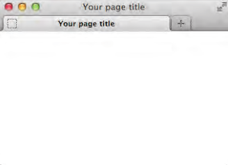

# 网页的构造块

网页三部分：

- 文本内容
- 对其他文件的引用
- 标记

## HTML思想

略

## 基本的HTML页面

访问者看到的是位于主体`<body>`标记内的部分。

## 标记：元素、属性、值、其他

### 元素(element)

空元素

XHTML要求空元素结尾必须有斜杠。

### 属性和值

HTML5中属性值俩边的引号可选

最常见的还是那些仅接受预定义值（也称为枚举值）的属性。

有一种特殊的属性称为布尔属性（Boolean attribute）。这种属性的值是可选的，因为只要这种属性出现就表示其值为真。如果一定要包含一个值，就写上属性名本身（这样做的效果是一样的）。

### 父元素和子元素

如果一个元素包含另一个元素，它就是被包含元素的父元素，被包含元素称为子元素。

## 网页的文本内容

浏览器会把文本中的空格或制表符压缩成单个空格。

过去HTML用ASCII字符。由于ASCII的局限性，导致开发人员必须用特殊的字符引用来创建重音字符。

## 链接、图像和其他非文本内容

HTML可以引用图像、视频、音乐等媒体文件。

过去，HTML 没有内置的方法播放视频和音频文件。结果，各个厂商都开发出了相应的软件，用户可以下载并安装这些软件，从而弥补缺失的功能。 这样的软件称为**插件**（plugin） 。

插件会耗费较多的计算资源。

## 文件名和文件夹名

较长的文件名使用`-`不要用`_`，且使用小写字母。否则对搜索引擎的支持程度不高。

1. 文件名采用小写字母
2. 使用正确的扩展名：`html`、`htm`
3. 用短横线分隔单词

SEO可以让网页在搜索引擎的搜索结果更靠前

## URL

URL，_Uniform Resource Locator_，统一资源定位符。是地址的别名。

常见HTTP，_Hypertext Transfer Protocol_，即超文本传输协议

HTTPS是HTTP衍生而来，用于安全网页。

其他的有：

- FTP，_File Transfer Protocol_，文件传输协议
  
- mailto，发送电子邮件
  

绝对 URL _absolute URL_ 包含了指向目录或文件的完整信息，包括模式、主机名和路径。

相对 URL以包含URL本身的文件的位置为参照点，描述目标文件的位置。

## 有含义的标记

**语义化HTML**（semantic HTML）指的是那些使用最恰当的HTML元素进行标记的内容，在标记的过程中并不关心内容显示。

语义的重要原因：

- 提升可访问性和互操作性
- 提升搜索引擎优化的效果
- 使维护代码和添加样式变得容易
- 使代码更少， 页面加载更快

### 搜索引擎优化(SEO)

搜索引擎对用特殊方式标记的内容会赋予更高的权重。

## 浏览器对网页的默认显示效果

每个Web浏览器都有一个内置CSS文件。

HTML5前大多元素都算**块级**(block-level)或者**行级**(inline)。但HTML5废弃了这些术语，因为这些术语把元素与表现关联起来，而 HTML 并不负责表现。