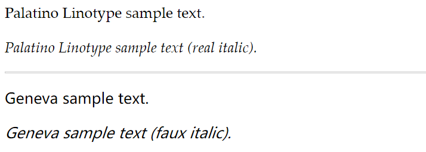
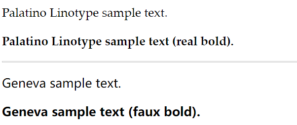
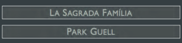

# 为文本添加样式

www.htmlcssvqs.com/8ed/10

## 选择字体

```css
body {
    font-family: 字体名;
}
```

`font-family`是继承属性，所以`body`所有字体都会使用我们指定的字体名。当指定的字体名在客户端系统没有安装，那么会使用默认字体。

多个单词的字体名应该用引号包起来。

有些元素如`select`、`textarea`、`input`就不会继承父元素的字体样式。

## 指定替代字体

就是同时指定多个字体

```css
body {
    font-family: 字体1, 字体2, ...;
}
```

字体列表称为**字体栈**(font stack)。

通常字体栈包含：

- 想用的字体
- 替代的字体
- 表示类属的标准字体，如`serif`、`sans-serif`、`cursive`、`fantasy`、`monospace`，它们表示首选字体最接近的风格。

尽量用所有系统都有的字体。

## 斜体



### 创建

传统出版业常用斜体表示引述、强调文本、外文单词、学名、电影片名等。

```css
p {
    font-style: italic;			// 创建斜体文本
    font-style: oblique;		// 创建倾斜文本 若有字体有斜体版本就是斜体版本 否则就是伪斜体 与上面一样
}
```

大多时候都用`italic`。

### 取消

```css
p {
	font-style: normal;
}
```

## 应用粗体格式



浏览器通常默认给`h1-h6`添加粗体格式。

```css
p {
    font-weight: normal;		/* 取消粗体 */
    font-weight: bold;			/* 粗体 */
    font-weight: 700;			/* 可选100-900之间 700即是粗体 */
    font-weight: bolder;		/* 更粗 */
    font-weight: lighter;		/* 更细 */
}
```

各种字体定义粗细的方式不同，可能有的字体的粗体看起来要比其它字体细。

`font-weight`是继承的。

## 设置字体大小

```css
body {
    font-size: 100%;		/* 16px */
    font-size: 2.1875em;	/* 35px/16px */
    font-size: .9375em;		/* 15px/16px */
    font-size: x-small;		/* 还有xx-small small medium large x-large xx-large */
}
```

`em`表示倍数，即`1em`就是默认字体大小。而相对的默认字体大小指的是父元素的字体大小。

CSS3引入`rem`，则是以根元素作为参照设置其它元素的字体大小。

推荐使用相对倍数的`em`

## 设置行高

```css
p {
    line-height: 1.45;		/* 假设字体大小是16px 那么行高就是字体的1.45倍 */
    line-height: 145%;
    line-height: 1.45em;
}
```

## 同时设置

必须先设置字体大小，再设置其它。

```css
p {
    /* .875em/1.3表示字体大小为.875倍数 行高是其(.875em)的1.3倍 */
    font: .875em/1.3 "Palatino Linotype", Palatino, serif;
}
```

`font`属性是继承的。

## 设置颜色

支持：

- 颜色名称
- 十六进制
- RGB
- HSL
- RGBA
- HSLA

```css
p {
    color: blue;
    color: #7d717c;
    color: rgb(r, g, b);
    color: rgb(r%, g%, b%);
    color: hsl(h, s, l);		/* 一般对于不透明色 使用十六进制或者RGB更好 */
    color: rgba(r, g, b, a);
    color: hsla(h, s, l, a);
}
```

## 设置背景

### 文本背景颜色

```css
body {
    background-color: #88b2d2;
}
```

### 背景图像

```css
body {
    background-image: url(background.png);
}
```

#### 重复背景图像

```css
	background-repeat: repeat;		/* 同时横向和纵向重复图像 */
	background-repeat: repeat-x;	/* 仅横向重复 */
	background-repeat: repeat-y;	/* 仅纵向重复 */
	background-repeat: no-repeat;	/* 不重复 */
```

### 控制背景图像是否跟随页面滚动

```
	background-attachment: fixed;	/* 跟着窗口 访问者滚动页面图像也会继续显示 */
	background-attachment: scroll;	/* 也就是默认值 即只在页面特定位置能够看到 */
```

### 指定元素图像的位置

```css
	background-position: x y;	/* x和y表示距离左上角的绝对距离或者百分数 */
	background-position: 20px 147px; /* 可以是负数值 */
	background-position: top right;		/* 顶端靠右(右上角) 还有类似的center left bottom 如果两个值都是关键字 那么顺序随便 */
```

### 统一设置

```css
body {
    background: #004 url(../img/ufo.png) no-repeat 17px 20px;
}
```

- `background-color`的默认值是透明的
- 背景的默认值是`None`
- `background-repeat`默认是重复
- `background-attachment`默认是`scroll`滚动
- `background-position`默认是左上角

尽量使用简记法。

默认元素背景会填充其内容和内边距所在区域，并且延伸到边框的边缘。可以用`background-clip`改变。

### 更多

`background-clip`和`background-origin`两个属性分别控制元素背景显示的范围和开始的位置。它们都接受相同的值：

- `content-box`包含内容
- `padding-box`包含内容和内边距
- `border-box`包含内容、内边距、边框

`background-clip`的默认值是`border-box`。`background-origin`的默认值是`padding-box`。

`background-size`可以通过如下属性值控制背景图像的显示尺寸：

- `contain`：在显示图像完整宽度和高度的情况下，尽可能地扩大图像地尺寸。使用这个值后背景图像可能不会填充整个背景区域。
- `cover`：在填充元素整个背景区域的情况下，让图像尽可能缩小。使用该值后图像的一部分可能会超出元素的范围导致不可见。
- 一个长度、百分数或者`auto`：`background-size: 250px 400px;`或`background-size: 50% 50%;`
- 更多参见 www.css3.info/background-size/

## 控制间距

单词间的是字间距，字母间的是字偶距

```css
p {
    /* 可以是负数 */
    word-spacing: length;		/* 字间距 length是个带单位的数值 如0.4em或5px 若为normal或0就是默认值 */
    letter-spacing: length;		/* 字偶距 length同上 */
}
```

`em`值会继承父元素的大小，比如父元素字体是`16px`，那么间距`0.1em`就是`1.6px`。

间距是继承的。

## 添加缩进

```css
	text-indent: length;	/* 段落第一行前空出的空间 */
```

可以给`p`元素之外的元素使用，但是默认对`em`、`strong`、`cite`等内敛元素没用，可以将它们设成`display: block`或者`display: inline-block`。就可以强制他们使用。

使用负数会产生悬挂缩进。使用悬挂缩进可能还要给文字加内边框或外边距，使容器可以容纳伸到外边的文本。

`text-indent`是继承的。

忽略继承的缩进用`0`就行。

## 对齐文本

```css
	text-align: left;		/* left左对齐 right右对齐 center屏幕中间 */
```

对行内元素没用

`text-align`是继承的。

## 修改文本的大小写

```css
	text-transform: uppercase;		/* capitalize每个单词首字母大写 uppercase所有字母大写 lowercase所有字母小写 none保持文本原样 */
```

`text-transform`属性是继承的。

## 使用小型大写字母

很多字体都有对应的小型大写字母变体，其中一些字母是大写的，但缩小到了小写字母的大小。



```css
	font-variant: small-caps;		/* small-caps小型大写字母 none取消 */
```

有些字体没有对应的小型大写字母。如果没有那么可能：

- 缩小大写字母的尺寸模拟小型大写字母
- 完全忽略小型大写字母，将之显示成全部大写

`font-variant`属性是继承的。

## 装饰文本

```css
	text-decoration: underline;		/* 下划线 */	
	text-decoration: overline;		/* 上划线 */
	text-decoration: line-through;	/* 删除线 */
	text-decoration: none;			/* 取消 */
```

常用于`a`的伪元素中

## 设置空白属性

默认HTML里的多个空格和回车会被认为是一个空格，或者直接被忽略。

要让浏览器显示这些空格，可以用`white-space`：

```css
	white-space: pre;		/* 显示原文本里的所有空格和回车 */
	white-space: nowrep;	/* 确保所有空格不断行 即文本全显示在一行 就算浏览器窗口太窄显示不了所有文本也不会换行 */
	white-space: normal;	/* 正常方式处理空格 */
```

针对`nowrep`可以添加：

```css
	overflow: hidden;
	text-overflow: ellipses;
```

表示超出元素盒的文本会显示为省略号。


