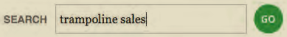

# 用CSS进行布局

## 开始布局的注意事项

一些有助于网站进行布局，并在发布之前对网站进行调整。

### 内容与显示分类

应该始终保持内容HTML和显示CSS相分离。

### 布局方法

网站设计主要有两大类：

- 对于**固定**(fixed)布局，整个页面和每一栏都有基于像素的宽度。也就是不管用什么设备查看页面，它的宽度都不会变。
- **响应式**页面也成为**流式**(fluid或者liquid)页面，使用百分数定义宽度，允许页面随着现实环境的改变进行放大或者缩小。除具有流动性外，还可以根据屏幕尺寸以特定方式调整其设计。比如可以更高图像大小或者调整每一栏，使其大小更合适。这就可以在使用相同HTML的情况下，为移动用户，平板电脑用户和桌面用户定制单独的体验，而非三个网站。

响应式Web设计器的起源是：_Ehan Marcotte_创建了术语"响应式Web设计"(responsive Web design)，并向人们介绍了创建响应式网站的技术。人们首次广泛关注这种方法始于他发表在[_A list Apart_上的文章](https://www.alistapart.com/articles/responsive-web-design)。他在_Web Design_一书里对此作了更加深入细致的探讨。

### 浏览器注意事项

要在开发过程中对用户们主要可能是用的浏览器进行测试。

## 构建页面

高效网页的核心是结构良好，语义化的HTML。

- 构建页面：恰当地使用`article`、`aside`、`nav`、`section`、`header`、`footer0`、`div`等元素把页面分成不同的逻辑区块。根据需要对它们应用ARIA地表角色。
- 按照一定的顺序防止内容，确保页面在不适用CSS的情况下也是合理的。比如：先是报头，然后主体内容，然后一个或者多个附注栏，最后是页面级的页脚。最重要的内容放在最上面，确保小屏幕用户能够很快看到。且搜索引擎实际看到的页面也和没有用CSS差不多。
- 用一致的方式使用标题元素，从而明确地标识页面上这些区块的信息，并对它们按优先级排序。
- 使用合适地语义标记剩余内容，如段落、图、列表
- 如有必要，可以用注释来标识页面上不同的区域和内容。

## 在旧版浏览器里给HTML5元素添加样式

大多浏览器允许对它们并不原生支持地元素添加样式。IE8-是个例外，但是也有解决方法，导入如下JS文件即可：

http://html5shiv.googlecode.com/svn/trunk/html5.js

IE8-会忽略它们不原生支持的元素的CSS。HTML5shiv是专门解决该问题的JavaScript，有时也称HTML5shim。

## 对默认样式进行重置或标准化

每个浏览器都有内置的默认样式表。

抹平差异的方法：

- 使用CSS重置开始主样式表，比如_Eric Meyer_创建的[Meyer重置](https://meyerweb.com/eric/tools/css/reset/)。CSS重置可以有效地将所有默认样式都设为零。
- 使用_Nicolas Gallagher_和_Jonathan Neal_创建的[normalize.css开始主样式表](http://necolas.github.io/normalize.css/)。该方法并非对所有样式进行重置，而是对默认样式进行微调，使它们在不同的浏览器里具有相似的外观。
- 还可以自己编写相应的CSS。

也不一样定非要用CSS重置或者normalize.css，因为里面有些东西可能是我们网站上不需要的。

## 盒模型

CSS处理网页的时候，它认为每个元素都包含在一个不可见的盒子里面。这就是众所周知的**盒模型**，这里的盒子由内容区域、内容区域周围的空间(内边距：padding)、内边距的外边缘(边框：border)和边框外面把元素与相邻元素隔开的不可见区域(外边距：margin)构成。

可以理解成带框架的画：

- 图画是内容
- 衬边是内边距
- 框架是边框
- 该画框和相邻画框间的距离是外边距


默认情况下：宽度和高度只定义内容区域的尺寸。背景(蓝色区域)会延伸到边框后面。所以通常情况下，背景只在内边距所延伸到的区域可见，除非边框是透明或者半透明的。

### 宽度和高度和盒模型

CSS中的宽度指：内边距里内容区域的宽度

浏览器的宽度指：内容宽度、左右内边距和左右边框的总和

## 控制元素的显示类型和可见性

造成行内元素和块级元素的本质是它们的`display`属性：即块级元素被设置成`display:block`，而行内元素被设置成`display:inline`。

使用CSS可以改变元素的默认显示类型，比如`block`可以改成`inline`，或者也可以反过来。

还有种混合方式称为`inline-block`，让元素和其它内容出现在同一行，同时具有块级元素的属性。

还可以通过设置`display`属性让元素完全不在页面上显示(`none`)。

设置为`inline`的元素会忽略任何`width`、`height`、`margin-top`和`margin-bottom`设置。不过设置为`inline-block`的元素可以使用这些属性，比如这里的`em`可以设置`width`。

### 文档流

默认情况下，元素会按照它们在HTML种自上而下的次序显示(俗称**文档流**：document flow)，并在每个非行内元素的开头和结尾处换行。

### 指定元素的显示方式

```css
选择器 {
    display: block;					/* 选择器选择的元素微块级元素 */
    display: inline-block;			/* 让元素显示为行内元素 同时具有块级元素的特征 */
    display: none;					/* 隐藏元素 */
}
```

`display`还有其它几个值，但是浏览器对它们的支持程序是有差异的。

例如，`grid`和`flex`属性提供了一些额外的布局技术，但是它们还没有进入最终的规范。[参考](http://developer.mozilla.org/CSS/display)

### 控制元素可见性

`visibility`属性的主要目的是控制元素是否可见。

和`display`不同的是，使用`visibility`隐藏元素时，元素及其内容应该出现的位置会留下一片空白区域。隐藏的元素仍然会在文档流占据位置。

设置方法：

```css
选择器 {
    visibility: hidden;		/* 元素不可见 */
    visibility: visible;	/* 显示元素 */
}
```

## 设置元素的高度和宽度

### 步骤

```css
选择器 {
    width: w;			/* w是元素内容区域的宽度 可以表示长度(带单位 如px、em等)或者父元素的百分数 或者用auto让浏览器计算宽度 */
	height: h;			/* 元素内容区域的高度 与宽度的参数类似 不过没有百分数 */
}
```

对定宽页面使用像素，对响应式Web设计使用百分数。

内边框、边框和外边距都不包含在宽度或者高度的数值里。

### 宽度和外边距和auto

如果不显式设置宽度和高度，浏览器就会使用`auto`。`width`的`auto`值是由**包含块**的宽度减去元素的内边距、边框和外边距计算出来的。

也就是块的宽度是父元素给元素留出来的宽度。

如果手动设置`width`，并将左右外边距都设置为`auto`，那么两个外边距就将设为相等的最大值，这样会导致元素居中：

```css
.page {
    margin:0 auto;
}
```

会使对应的元素在页面剧中。

#### min-height通常比height更适用

如果设置了高度，随着内容变多，它们有可能撑破元素的盒子，这可能是你预期之外的。在这种情况下，符合标准的浏览器**不会**自动扩大高度，它们在你指定高度时采用了这个指定，并且一致坚持下。

但如果希望元素**至少**具有某一特定高度，可以设置`min-height`。如果内容以后增多，元素的高度也会自动按需求增长。

## 在元素周围添加内边距

```css
选择器 {
    padding: 值;			/* 值可以是带单位的数 也可以是父元素宽度的百分数 */
}
```

## 设置边框

```css
选择器 {
    border: 5px solid #bebebe;		/* 边框粗细 边框风格 边框颜色 可以不按顺序 */
}
```

### 边框风格

如果要让边框显示，必须要定义一种边框样式

```css
    border-style: 边框风格;
```

| 边框风格 | 含义   |
| -------- | ------ |
| `none`   | 不显式 |
| `dotted` | 点线   |
| `dashed` | 虚线   |
| `solid`  | 实线   |
| `double` | 双线   |
| `groove` | 槽线   |
| `ridge`  | 脊线   |
| `inset`  | 凹边   |
| `outset` | 凸边   |

### 边框宽度

```css
    border-width: 边框宽度;		/* 含单位 */
```

### 边框颜色

边框的默认颜色是元素的`color`属性的值

```css
    border-color: 边框颜色;		/* 与color一样 */
```

### 其它

CSS3引入了`border-image`属性。除了[IE之外的浏览器](http://caniuse.com/#search=border- image)对它支持都不错。

可参考网站：

- [www.sitepoint.com/css3-border-image](www.sitepoint.com/css3-border-image)
- [css-tricks.com](https://css-tricks.com/)

## 设置元素周围的外边距

外边距是元素和相邻元素之间的透明空间：`<h1>第一个标题</h1>这里<h1>第二个标题</h1>`

```css
选择器 {
    margin: 值;			/* 值是要添加的空间量 可以表示长度 相对父元素宽度的百分数或者auto */
}
```

- 若值只有一个，那就表示上、右、下、左全都是。
- 若是两个，那第一个就表示上下，第二个表示左右
- 若是三个，就是上、右、下。
- 四个就上、右、下、左。

`margin`属性的`auto`值依赖于`width`属性的值。

若元素位于另一个元素的上面，对于相互接触的两个`margin`，就只用较大的那一个，小的就被忽视或者说覆盖了。

外边距不继承

当`em`用于内边距和外边距的时候，`em`值是相对于元素的字体大小的，而不是父元素的字体大小：示例：

```css
p {
    font-size: 14px;
    padding: .5em;
}
```

则四个边的内边距都是`7px`(14*0.5)。外边距同理。

像这种相对设置对于响应式Web的优势更好，但是在固定宽度的布局也有作用。[_Trent Walton_介绍了一个强大的使用相对单位的例子。](http://trentwalton.com/2013/01/07/flexible-foundations)

对于内边距和外边距最好使用相对单位。

如果要对内边距和外边距使用百分数，同行不会将他们用于上下边距的值，因为这样的值是基于其包含块的宽度。

## 使元素浮动

可以通过`float`属性使元素浮动在文本或者其他元素之上，比如让文本环绕在图像周围。

```css
选择器 {
    float: left;
}
```

## 控制元素浮动的位置

浮动的元素对文档流的影响与非浮动元素的影响是不同的。图像等浮动元素会让接下来的内容环绕在它周围。不过它不会影响父元素或者其它祖先元素的高度，因此从这一点来说，它不属于文档流的一部分。


但若如果删除多余的文本，即


图像是`section`的子元素，但`section`却比图像更矮一些！页脚跑到了图像右边。

其实可以清除浮动带来的效果：

```css
.post-footer {
    clear: left;
}
```


### 让浮动元素的父元素"自清除"

```css
选择器 {
    clear: both;		/* 清除左右浮动 还有right left none */
}
```

这样可以让选中的元素显示在浮动的元素的下方。但是容器的高度仍然是`0`。

大多时候这样做没有问题。但是如果想给容器添加一个背景色，因为容器高度是0，不会显示那个背景色。解决的方法是让容器自身具有清除浮动的能力。

最可靠的方法是用`clearfix`，只需要在样式表引入`.clearfix`的规则，然后为浮动元素的父元素(该元素为希望清除浮动的元素)添加`clearfix`类，从而可以支撑起父元素，并能够添加一些预期样式。


预期样式示例：


### 补充：使用overflow创建自清除浮动元素

可以对浮动元素的父元素使用`overflow`属性以替代`clearfix`方法，例如，在上面的代码里面做修改：

```css
.container {
    overflow: hidden;
}
```

某些情况下`overflow: hidden`会吧内容截断。有时使用`overflow:auto;`也有用，但这样做可能会出现一个滚动条。

## 对元素进行相对定位

每个元素在页面的文档流里都有一个自然位置。相对于这个原始位置对元素进行移动就称为相对定位。


```css
.example {
    position: relative;
    top: 35px;
    left: 100px;
}
```


相较之前位置，文本与上边相距35像素，左边相距100像素。

使用相对定位、绝对定位、固定定位时，对于相互重叠的元素，可以用`z-index`属性指定它们的叠放次序。

对元素设置`position: static`，可以覆盖`position: relative`设置。`static`是元素的默认值。

定位不被继承。

## 都元素进行绝对定位

元素绝对定位，即指定它们相对于`body`或最近的以定位祖先元素的精确位置。可以让元素脱离正常的文档流。

绝对定位不会在原来位置留下空白。也不会让文字在它旁边浮动。事实上，其他内容不知道它的存在，它也不知道其它内容的存在。

```css
选择器 {
    position: absolute;
    top: 41px;
    right: 0;
}
```


图标飞到了右上角。

相对于`.masthead`选中的元素进行绝对定位。


就没有那么死板非要靠在左上角了。

还有种定位类型称为固定定位。当访问者滚动浏览器窗口的时候，页面内容通常随之上下移动。如果对元素设置`position:fixed;`它就会固定在浏览器窗口里。当访问者上下滚动浏览器窗口时，该元素不会随之移动，页面的其余部分仍然照常滚动。固定定位在很多移动浏览器里效果不好，所以如果想让自己的网页可以很好地适应移动设备，最好不要用固定定位。

对元素设置`position: static`会覆盖`position: absolute;`的设置。

定位不是继承的。

## 在栈中定位元素

使用相对定位、绝对定位、固定定位之后，容易发现元素相互重叠的情况。这时候就可以选择哪些元素在顶层出现。

```html
<div class="box1"><p>Box 1</p></div>
<div class="box2"><p>Box 2</p></div>
<div class="box3"><p>Box 3</p></div>
<div class="box4"><p>Box 4</p></div>
```

CSS：

```css
div {
    border: 1px solid #666;
    height: 125px;
    position: absolute;
    width: 200px;
}

.box1 { 
    background: pink;
    left: 110px;
    top: 50px;
    z-index: 120;
}

.box2 { 
    background: yellow; 
    left: 0;
    top: 130px;
    z-index: 530;
}

.box3 { 
    background: #ccc; 
    position: static; 
    /* 静态的，没有任何效果  */ 
    z-index: 1000;
}

.box4 {
    background: orange;
    left: 285px;
    top: 65px;
    z-index: 3;
}
```

对于定位元素，`z-index`最高的数显示在最上面，不管该元素在HTML里出现的次序。

上述示例中，第一条规则为所有`div`设置了`positoin:absolute;`，而定义`.box3`时又覆盖了这个规则，让`.box3`回到默认的`static`。所以虽然`.box3`的值是最高的，但是没有任何效果，它总是位于最底层。

对混合使用相对定位、绝对定位、固定定位的元素，`z-index`会把它们作为整体进行安排，而不是分别安排。

## 处理溢出

元素不总是包含在它们自己的盒子里。这可能是因为盒子不够大。比如图像比它的容器更宽就会溢出，也可能是因为使用负值的外边距或者绝对定位让内容处于盒子的外面，还有可能你对元素设置了显式高度，它的内容太高而无法装入盒子内部。

这里就再需要用到`overflow`


处理溢出：

```css
div {
    overflow: 值;
}
```

| 值        | 含义                                   |
| --------- | -------------------------------------- |
| `visible` | 让元素盒子里的所有内容可见，默认项     |
| `hidden`  | 隐藏元素盒子容纳不了的内容             |
| `scroll`  | 不管元素是否需要，都在元素上添加滚动条 |
| `auto`    | 让滚动条只在访问者访问溢出内容时候出现 |

## 垂直对齐元素

可以使用除默认对齐方式以外的多种方式对齐元素，让他们在页面上显得比较整齐


默认行内内容在竖直方向上与文本的基线对齐

每行内容都有一个看不见的(线)框，它代表了行的高度。在下述示例里，文本输入的字段就能指示框的下边缘，因为它是这一行最低的部分，图像会对其线框的底部：


```css
input[type="image"] {
    vertical-align: bottom;
}
```



其它参数：

| 参数          | 含义                                   |
| ------------- | -------------------------------------- |
| `text-bottom` | 让元素的底部对齐父元素的底部           |
| `top`         | 让元素的顶部对齐当前行里最高元素的顶部 |
| `bottom`      | 使元素的底部对齐当前行里最低元素的底部 |

除此之外还可以输入当前元素行高的百分比，可以是整数、负数；或者输入某个值，正负都行，单位是像素或者`em`，分别按照特定的值上下移动。

`verical-align`只适合用在行内元素，不适合用在块级元素。更多参考[_Chris Coyier_的解释](http://css-tricks.com/what-is-vertical-align/)

## 修改鼠标指针

```css
选择器 {
    cursor: 参数;
}
```

| 参数        | 含义                                     |
| ----------- | ---------------------------------------- |
| `pointer`   | 表示停留在链接上面时候通常显示的指针形状 |
| `default`   | 默认箭头                                 |
| `crosshair` | 加号                                     |
| `move`      | 移动                                     |
| `wait`      | 等待                                     |
| `help`      | 箭头加问号                               |
| `text`      | 文本内容                                 |
| `progress`  | 箭头加等待                               |

使用`auto`显式特定情况下通常使用的指针形状。

使用`x-resize`表示双向箭头，这里的`x`是其中一个箭头需要指向的方向，可以是n(北)、nw(西北)、e(东)等等。

比如`e-resize`指针显示成


不同浏览器、不同系统的指针形状可能不同。

