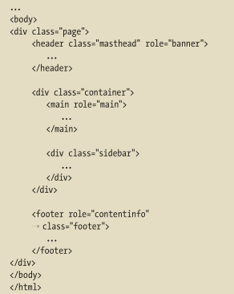
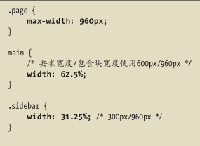
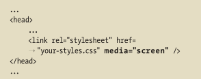
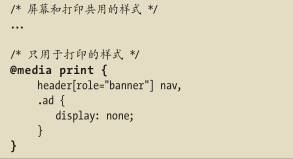
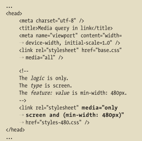
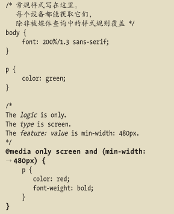
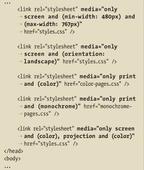
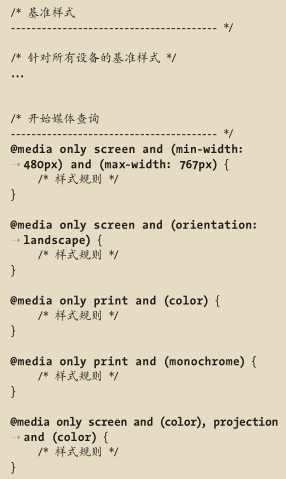

# 构建响应式网站

## 概述

_Ethan Marcotte_将相应的方法命名为响应式Web设计(responsive Web design)。

方法根植于以下三点：

- 灵活的图像和媒体。图像和媒体资源的尺寸是用百分数定义的，从而可以根据环境进行缩放。
- 灵活的、基于网格的布局，也就是流式布局。对于响应式网站，所有的`width`属性都用百分数设定。其他水平属性通常也用相对单位。
- 媒体查询。使用这项技术，可以根据媒体特征(如浏览器可视页面区域的宽度)对设计进行调整。

_John Allsopp_的文章["Web设计之道"](http://alistapart.com/article/dao)写于2000年，该文讨论了设计和构建灵活的网站的方法。该文章是响应式Web设计的先驱，_Marcotte_以及很多其他的作者都引用过这篇文章，且认为它影响巨大。

_Jeremy Keith_在题为["One Web"的演讲](www.vimeo.com/27484362/)中归纳了"一个网站适用所有设备"的方法。[讲稿全文参见](www.adactio.com/articles/4938/)

## 创建可伸缩图像

在HTML里面`img`标签省略`width`和`height`属性，在样式表里面添加`max-width:100%;`

可以使用`background-size`属性对背景图像进行缩放(对IE8无效)。[更多参见](www.css3.info/preview/background-size/)

还可以使用`video`，`embed`，`object`让HTML5视频和其他媒体变成可以伸缩的。

##  创建弹性布局网格





需要使用的百分数值：$要指定的宽度(像素单位)/容器宽度(像素单位)=值$

这与_Ethan Marcotte_的公式(目标/环境=值)一致，只是解释更加明了。

## 理解和实现媒体查询

前面说过的可以针对特定的媒体类型定位CSS:

- 使用`link`元素的`media`属性
  
- 在样式表中使用`@media`规则
  
- 使用`@import`

**媒体查询**增强了媒体类型方法，允许根据特定的设备特性定位样式。要调整网站的呈现央视，让其适应不同的屏幕尺寸，采用媒体查询特别方便。

以下是可以包含在媒体查询里的媒体特性：

- `width`：宽度
- `height`：高度
- `device-width`：设备宽度
- `device-height`：设备高度
- `orientation`：方向
- `aspect-ratio `：高宽比
- `device-aspect-ratio`：设备高宽比
- `color`：颜色
- `color-index `：颜色数
- `monochrome`：单色
- `resolution`：分辨率
- `scan`：扫描
- `grid`：栅格

还有些非标准的媒体特性，如：

- `-webkit-device-pixel-ratio`[^1]
- `-moz-device-pixel-ratio`[^2]

除`orientation`、`scan`和`grid`之外，上述属性均可添加`min-`和`max-`前缀。`min-`前缀定义的是"大于等于"对应值的目标，而`max-`前缀定义的则是"小于等于"对应值的目标。

IE8-不支持媒体查询。

### 媒体查询语法和示例

#### 指向外部样式表的链接

```html
<link rel="stylesheet" media="logic type and (feature: value)" href="your-stylesheet.css" />
```

#### 位于样式表里的媒体查询

```css
@media logic type and (feature: value) {
    /* 目标CSS样式规则写在这里 */
} 
```

### 示例

#### 示例一

当媒体类型为`screen`且视觉区域最小宽度是`480`像素时，加载并且使用`style-480.css`中的样式规则：



`base.css`里的样式用于所有的输出设备。`style-480.css`里的样式用于支持媒体查询且视觉区域宽度不低于`480`像素的浏览器。

#### 示例二

拥有默认段落样式，但是当媒体查询结果为真时会对段落文本的修改。



### 代码组成

- `logic`：(逻辑)部分可选，其值可以是`only`或者`not`。`only`关键字可以确保旧的浏览器不读取余下的媒体查询，同时一并忽略链接的样式表。`not`关键字可以对媒体查询的结果求反。例如`media="not screen"`会在媒体类型不是`screen`的时候加载样式表。
- `type`：(类型)部分是媒体类型，如`screen`、`print`等。
- `feature`：`value`对是可选的，但如果有，就必须要用括号包围且前面要有`and`这个词。`feature`是预定义的媒体特征，如`min-width`、`max-width`、`resolution`。对`color`、`color-index`和`monochrome`特性来说，`value`是可选的。

可以使用`and`把多个特性和值的组合串接起来，还可以创建一系列媒体查询(使用逗号分隔每个媒体查询)。在用逗号分隔为真，则整个媒体查询列表为真。

多种媒体查询示例：

	


任何位于媒体查询之外的基准样式规则都会应用在所有设备。可以使用媒体查询覆盖这些样式规则。

需要注意的：媒体查询样式规则声明只在和常规样式**冲突**时覆盖。

[CSS3媒体查询规范中列出了关于所有媒体特性的描述](https://www.w3.org/TR/css3-mediaqueries/#media1)

理解视觉区域及视觉区域`meta`元素

视觉区域(viewport)指的是浏览器(包括桌面浏览器和移动浏览器)显式页面的区域。它不包含浏览器地址栏、按钮之类的东西，只是浏览区域。媒体查询的`width`特性对应的是视觉区域的宽度。但是`device-width`指的是屏幕宽度。

将视觉区域的宽度设成和设备宽度相同的值：

```html
<!DOCTYPE HTML>
<html lang="en">
    <head>
        <meta charset="utf-8" />
        <title>测试</title>
        <!-- 将视觉区域的宽度设成和设备宽度相同的值 -->
        <meta name="viewport" content="width=device-width, initial-scale=1" />
    </head>
</html>
```

重点是`width=device-width`。有了这条语句，视觉区域的宽度会被设成和设备宽度相同的值。代码中的`initial-scale=1`对`width`和`device-width`没有影响。它将页面的默认缩放级别设成了`100%`，换成纵向模式也一样。对于[IOS6前有个bug](http://adactio.com/journal/5802/)，如果不设置成`initial-scale=1`，就会把手机的纵向模式改成横向模式，网页会被放大，使得布局和纵向模式一样。

## 组合使用

不需要先做一个定宽的设计，再把它转成响应式的页面。

### 创建内容和HTML

从可靠的、认真考虑过的内容开始。不要尝试用占位符文本设计和构建网站。

### 移动优先方法

建议是在设计网页时遵循移动优先为页面设计。

- 为所有设备提供基准样式

- 此时要避免让元素浮动。基准样式包括基本的文本样式(字体、颜色、大小)，内边距、边框、外边距、背景、可伸缩图像的样式。或对容器设定宽度，最小的屏幕不够宽，内容将按照常规的文档流从上到下进行显示。
- 从这种样式开始，使用媒体查询逐渐为更大的屏幕(或其它媒体特性，比如`orientation`)定义样式。大多时候，`min-width`和`max-width`媒体查询特征是最主要的工具。

### 逐步完善布局

使用媒体查询为页面中的每个**断点**(breakpoint)定义样式。断点即内容须作适当调整的宽度。

[_Eivind Uggedal_的网站汇集了大量现实的响应式网站](http://mediaqueri.es)

[Screen Sizes网站提供了流行设备和显示屏的分辨率和设备宽度信息。可以帮助我们调整媒体查询](http://screensiz.es)

[_Maximiliano Firtman_维护了一个现代移动设备对HTML5和CSS3支持情况的表格](http://mobilehtml5.org)

有时候可能想给高像素密度设备设定样式。常见用例是为这样的显示屏准备双倍尺寸的sprite，使得图像显得更锋利。

假如你的 sprite 的的原始尺寸是 200 像素 ×150 像素，其中每个图像都用 1 像素分隔。创建一个双倍大小的版本（400 像素 ×300 像素），每个图像之间就有 2 像素的间隔。同时，sprite 中的每个图像都是原始尺寸的 2 倍。针对高像素密度设备，可以使用下面的媒体查询：

```css
@media (-o-min-device-pixel-ratio: 5/4), (-webkit-min-device-pixel-ratio: 1.25), (min-resolution: 120dpi) {
    .your-class {
        background-image: url(sprite-2x.png);
        background-size: 200px 150px;			/* 注意设置成了原始尺寸 而非400px 300px 这样会让图像缩小。为原始尺寸创建的样式对2x版本也有效 */
    }
}
```

## 兼容旧版IE

IE8-不支持媒体查询。

解决方法：

- 啥也不干，该咋样咋样

- 为它们单独创建单独的样式表，让他们显示成网站最宽的版本。一种做法是复制一份常规的样式表，将其命名为`old-ie.css`之类的文件名。在HTML里添加条件注释，使得不同浏览器都能找到正确的样式表：

  ```html
  <head>
      <!--[if gt IE 8]-->
      <link rel="stylesheet" href="css/styles.css" />
      <!--<![endif]-->
      
      <!--[if lt IE 9]-->
      <link rel="stylesheet" href="css/old-ie.css" />
      <!--<![endif]-->
  </head>
  ```

  [关于这些注释参考](https://www.quirksmode.org/css/condcom.html)，第一个条件注释表示IE8及更旧版本以外的浏览器使用的样式表，第二个注释表示只给IE9以下IE用的样式表。

- 如果希望页面有响应式的效果，就在页面里引入[respond.min.js](https://github.com/scottjehl/Respond)。_Scott Jehl_创建了这段简短的代码，使`min-width`和`max-width`媒体查询在对旧版IE也有用。但这也不是适用于所有网站的完美方案。

  ```html
  <head>
      <!--[if lt IE 9]-->				<!-- 其实条件注释可以不包含，但是包含了就会只有IE9以下会加载 -->
      <script src="js/respond.min.js"></script>
      <!--<![endif]-->
  </head>
  ```

如果使用Sass、LESS或者Stylus这类CSS预处理器，就可以自动创建为旧版IE准备的样式表。[_Nicolas Gallagher_分享了一个使用Sass的方法](http://nicolasgallagher.com/mobile-first-css-sass-and-ie/)

[^1]: WebKit 是 Chrome、Safari 等浏览器使用的网页引擎和 JavaScript 引擎开源程序。
[^2]: Mozilla 是 Firefox 等浏览器的基础程序。

