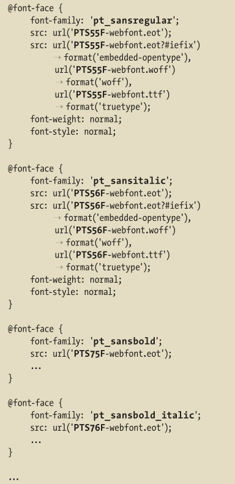
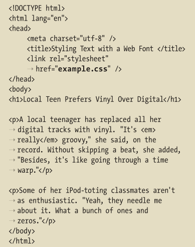
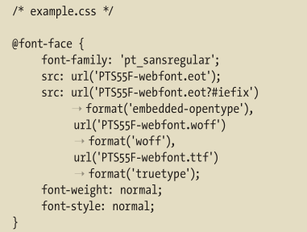
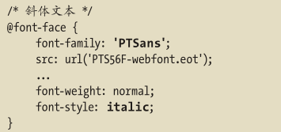
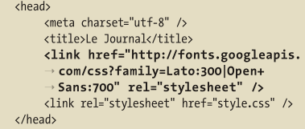

# 使用Web字体

## 什么是Web字体

CSS规则`@font-face`为Web字体创造了可能，该样式规则允许CSS链接到服务器上的一种字体供网页使用。

### Web字体文件格式和浏览器支持

Web字体可以使用一系列文件类型。下面介绍的前三种类型是如今常用的：

- 内嵌OpenType(Embedded OpenType,.eot)。IE8前只支持OpenType。内嵌OpenType是Microsoft的一项专有格式，它使用数字版权管理技术防止在未经许可的情况下使用字体。
- TrueType(.ttf)和OpenType(.otf)，台式机使用的标准字体文件类型。TrueType和OpenType得到了以下浏览器的广泛支持，这些格式不使用数字版权管理：
  - Mozilla Firefox(3.5+)
  - Opera(10+)
  - Safari(3.1+)
  - Mobile Safari(IOS4.2+)
  - Google Chrome(4.0+)
  - IE(9+)
- Web开放字体格式(Web Open Font Format，.woff)。这种较新的标准是专为Web字体设计的。Web开放字体格式的字体是经压缩的TrueType字体或OpenType字体。WOFF格式还允许在文件上附加额外的元数据。字体设计人员或者厂商可以使用这些元数据，在原字体信息的基础上，添加额外的许可证或者其他信息。这些元数据不会以任何方式影响字体的表现，但经用户请求，这些元数据可以呈现出来。支持的浏览器
  - Mozilla Firefox(3.6+)
  - Opera(11.1+)
  - Safari(5.1+)
  - Google Chrome(6.0+)
  - IE(9+)
- 可缩放矢量图形(Scalable Vector Graphics, .svg)。应该避免对Web字体文件使用SVG。它更多地用在早起Web字，因为它是IOS4.1上移动Safari唯一支持的格式(还有可能引起一些崩溃地情况)。从IOS4.2起，移动Safari开始支持TrueType。

### 法律问题

从技术层面上说，字体都是小的软件。

如果购买了一个字体，并且确切地知道可以将其用作Web字体，就可以使用Font Squirrel提供的免费[@font-face生成器](https://www.fontsquirrel.com/tools/webfont-generator)该工具可以将字体转换成万维网上使用的所有Web字体文件类型。

### 管理文件尺寸

略

### 构造子集

节省页面重量地一种方法是**构造子集**(subsetting)。构造子集是通过仅包含确定使用地字符消减实际字体大小的方法。比如有些网站对一些字体只使用大写，那其实就可以把小写版本从字体中溢出。这样字体文件大小就可以减少些。

上面提到的@font-face生成器可以帮助进行子集构造。

## 在哪里能找到Web字体

在网站上使用Web字体有两种方式：

- 自托管
- Web字体服务

### 自托管

自托管Web字体来源于自己的服务器，像图像、CSS文件一样。如果需要与字体相关的花费，通常也是一次性的购买支出，是否将字体文件上传到网站上并将其包含到代码中取决于自己。

一些流行的自托管字体来源：

- [Font Squirrel](https://www.fontsquirrel.com/)
- [MyFonts](http://myfonts.com)
- [The League of Moveable Type](https://www.theleagueofmoveabletype.com/)
- [FontShop](https://www.fontshop.com/)

### Web字体服务

Web字体服务通常提供订购Web字体的方法。这种方式是指按月或者按年支付使用字体的版权费用，而非彻底买断。

Typekit是该领域的先驱。

这些服务托管字体，为用户提供了或是JavaScript或是CSS代码，具体取决于服务本身。该代码包含了从远程服务器获取字体文件并将其显示在网站上这一过程所需的全部代码。

一些流行的Web字体服务包括：

- [Cloud.typography](https://www.typography.com/webfonts)
- [Edge Web Fonts](http://www.edgefonts.com/)
- [Fontdeck](http://fontdeck.com)
- [Fonts.com](https://www.fonts.com/web-fonts)
- [Fontspring.com](https://www.fontspring.com/)
- [Google Fonts](http://www.google.com/fonts)
- [Typekit](https://typekit.com)
- [WebINK](http://www.webink.com/)

### Web字体的质量和显示

不是所有的Web字体都一样。不同浏览器的Web字体显示效果有明显差异。有些字体在IE早期版本显示效果不好。

如果要检查，可以尝试使用[Web Font Specimen](http://webfontspecimen.com)提供的资源。这是一个测试Web字体在各种环境和字体大小下的显示效果的工具。

## 下载使用

略

## 理解@font-face规则

##  使用 Web 字体设置文本样式

	

## 为 Web 字体应用斜体和粗体

对于 Web 字体，每个字体只有一种粗细和一种风格。

如果你想使用粗体或斜体，就需要为它们创建单独的样式规则，每条规则对应一个 Web 字体文件。否则，浏览器就会使用伪粗体或伪斜体，或者同时使用伪粗体和伪斜体（后面将会看到）。

### 为Web字体应用斜体的步骤

导入斜体或粗体版本

斜体版本在@font-face里面的`font-style:normal`改成`font-style:italic`。

粗体版本在@font-face里面的`font-weight:normal`改成`font-weight:bold`

粗斜体版本要单独导入粗斜体版本的字体。这是一种字体，而非两种字体合成。

## 直接使用Web上的字体文件

如谷歌：

在www.google.com/fonts上找到自己享用的字体，然后导入方式如下

