# 使用CSS3进行增强

## 浏览器兼容性和渐进增强和polyfill

浏览器对本章将要介绍的属性开始提供基本支持的时间

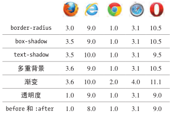

上图时桌面浏览器

关于移动浏览器和桌面浏览器的更多信息参见_Alexis Deveria_的[Can I Use网站](www.caniuse.com)，该表中的大部分信息都来自该网站

还有更简洁的支持性总结位于http://fmbip.com/litmus/

### 渐进增强

渐进增强意思是给不同浏览器提供不同的体验，好的浏览器提供好的体验，但是也顾及到差的浏览器，使得它们可以体验到不太落后于好的浏览器的体验。

渐进增强实例：[Dribbble](http://dribbble.com)

### 为不支持某些属性的浏览器使用polyfill

弥补弱浏览器和强浏览器的功能差异可以用`polyfill`(通常又叫**垫片**，shim)。

`polyfill`通常用JS实现，可以给较弱的浏览器提供一定程度的对HTML5和CSS3的API和属性的支持。

需要注意的是弱浏览器运行JS的速度会比较慢。

IE的常见`polyfill`：_Jason Johnston_的[CSS3 PIE](http://css3pie.com/)，它为IE6-9提供了本章讨论的大部分CSS效果的支持。其中IE9仅需要PIE提供对线性渐变的支持；对于其他效果，IE9提供原生的支持。

[HTML5Plase](http://html5please.com/)是个不错的资源，使用它可以找出哪些HTML5和CSS3可以放心使用，以及有哪些比较好的填补差距的`polyfill`。

[Modernizr](https://modernizr.com/)是个JavaScript库，它允许你探测浏览器是否支持创建优化的网站体验所需的特定的HTML5、CSS3及其它的特性。

[更多的CSS3效果](https://www.htmlcssvqs.com/resources/)

## 理解厂商的前缀

浏览器通常在W3C开发标准的过程中就会提前实现这些特性。这样，标准在最终敲定之前就能知道哪些地方还能进一步改进。

在包含某个特性的初始阶段，浏览器通常会使用厂商前缀实现这类特性：

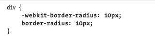

这样，每个浏览器都可以引入自己的CSS属性支持方式，且一旦标准发生改变也不会造成影响。

上图示例需要用`-webkit`前缀支持旧版本的Android、IOS、Safari浏览器。

但是这种方式会造成一定的混乱，所以很多浏览器都逐渐取消了厂商前缀的使用。但是还是有些地方要用到它们。至少在依赖他们的旧浏览器依然占据一定市场份额的时候是这样。

- Webkit/Safari/旧版本的Chrome：`-webkit-`
- Firefox：`-moz-`
- `-ms-`：IE
- `-o-`：Opera

应该把前缀放在CSS属性名的前面。

如今大多时候只用`-webkit-`前缀

下面两个网站可以让我们避免书写带前缀和不带前缀的CSS属性这种重复劳动：

- _Randy Jensen_的[CSS3 Generator](http://www.css3generator.com/)
- _Paul Irish_和_Jonathan Neal_的[CSS3, Please!](https://css3please.com/)

[其他厂商前缀参见](http://css-tricks.com/how-to-dealwith-vendor-prefixes/)

## 给元素创建圆角

```html
# html
<div class="all-corners"></div>
<div class="one-corner"></div>
<div class="elliptical-corners"></div>
<div class="circle"></div>
```

使用示例，包含了必要的厂商前缀以支持旧版Android、Mobile Safari和Safari浏览器：

```css
# css
div { 
    background: #999; 
    float: left; 
    height: 150px;
    margin: 10px;
    width: 150px;
} 

.all-corners { 
    -webkit-border-radius: 20px;	/* 适应旧版浏览器 圆角20像素 */
    border-radius: 20px;			/* 圆角20像素 */
} 

.one-corner { 
    -webkit-border-top-left-radius: 75px;
    border-top-left-radius: 75px;
} 

.elliptical-corners { 
    -webkit-border-radius: 50px / 20px;
    border-radius: 50px / 20px;
} 

.circle {
    -webkit-border-radius: 50%; 
    border-radius: 50%;
}
```

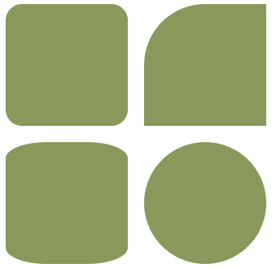

## 文本添加阴影

`text-shadow`本来是CSS2规范的一部分，但是在CSS2.1里面被移除了，后来在CSS3又出现了。

使用该元素可以在不使用图像表示文本的情况下，给段落、标题等元素里的文本添加动态的阴影效果

```html
<p class="basic">Basic Shadow</p>
<p class="basic-negative">Basic Shadow</p>
<p class="blur">Blur Radius</p>
<p class="blur-inversed">Blur Radius</p>
<p class="multiple">Multiple Text Shadows</p>
```

可以指定水平偏移量、垂直偏移量、模糊半径和颜色值，例如`-2px 3px 7px #999`

```css
p {
	color: #222; /* 接近黑色  */
	font-size: 4.5em;
	font-weight: bold;
}
 
.basic {
	text-shadow: 3px 3px #aaa;
}
 
.basic-negative { /* 负偏移值  */
	text-shadow: -4px -2px #ccc;
}
 
.blur {
	text-shadow: 2px 2px 10px grey;
}
 
.blur-inversed {
	color: white;
	text-shadow: 2px 2px 10px #000;
}
 
/* 添加多个阴影样式，每个用逗号分隔 */
.multiple {
	text-shadow:
		2px 2px white,
		6px 6px rgba(50,50,50,.25);
}
```

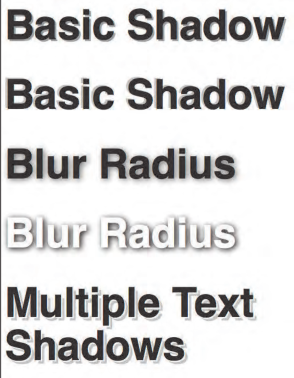

改回默认值

```css
	text-shadow: none;
```

## 为其他元素添加阴影

使用`text-shadow`可以给元素文本添加阴影，使用`box-shadow`属性则可以给元素本身添加阴影。`box-shadow`的属性集包含了`text-shadow`，且还包含两个可选的属性用于扩张或者收缩阴影：

- `inset`关键字属性
- `spread`属性。负的`spread`值会让阴影在元素内进行收缩。为`0`的水平偏移量表示阴影不会向左或右偏离该元素。

如果想兼容旧版Android、Mobile Safari、Safari，那么`box-shadow`需要加上`-webkit`厂商前缀。

[这方面内容最新信息参见](http://caniuse.com/#search=box-shadow)

```html
# html
<div class="shadow">
	<p>Shadow with Blur</p>
</div>
 
<div class="shadow-negative">
	<p>Shadow with Negative Offsets and Blur</p>
</div>
 
<div class="shadow-spread">
	<p>Shadow with Blur and Spread</p>
</div>
 
<div class="shadow-offsets-0">
	<p>Shadow with Offsets Zero, Blur, and Spread</p>
</div>
 
<div class="inset-shadow">
	<p>Inset Shadow</p>
</div>
 
<div class="multiple">
	<p>Multiple Shadows</p>
</div>
```

使用

```css
div {
	background: #fff;
	...
}
 
.shadow {
	-webkit-box-shadow: 4px 4px 5px #999;
	box-shadow: 4px 4px 5px #999;
}
 
.shadow-negative {
	-webkit-box-shadow: -4px -4px 5px #999;
	box-shadow: -4px -4px 5px #999;
}
 
.shadow-spread {
	-webkit-box-shadow: 4px 4px 5px 3px #999;
	box-shadow: 4px 4px 5px 3px #999;
}
 
.shadow-offsets-0 {
	-webkit-box-shadow: 0 0 9px 3px #999;
	box-shadow: 0 0 9px 3px #999;
}
 
.inset-shadow {
	-webkit-box-shadow: 2px 2px 10px #666 inset;
	box-shadow: 2px 2px 10px #666 inset;
}
 
.multiple {
	-webkit-box-shadow:
		2px 2px 10px rgba(255,0,0,.75),
		5px 5px 20px blue;
 
	box-shadow:
		2px 2px 10px rgba(255,0,0,.75),
		5px 5px 20px blue;
}
```

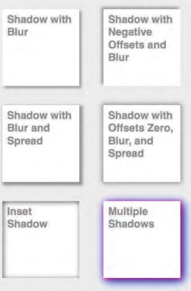

改回默认值：

```css
	box-shadow: none;
	-webkit-box-shadow: none;
```

## 应用多重背景

为单个HTML元素指定多个背景是CSS3引入的一个特性。通过减少对某些元素的需要(这类元素存在只是为了用CSS添加额外的图像背景)，指定多重背景便可以简化HTML代码，并且让它更加容易理解和维护。

多重背景几乎可以用在任何元素。

指定多重背景不需要使用厂商前缀。

```html
<div class="night-sky">
    <h1>In the night sky...</h1>
</div>
```

为`class="night-sky"`的单个`div`应用多重背景：

```css
.night-sky {
    /* 先给老浏览器的用户定义背景颜色。可选步骤。 */
	background-color: navy; /* 备用 */
	background-image:
		url(ufo.png), url(stars.png),
		url(stars.png), url(sky.png);

    background-position:
		50% 102%, 100% -150px,
		0 -150px, 50% 100%;

    background-repeat:
		no-repeat, no-repeat,
		no-repeat, repeat-x;
 
    height: 300px;
    margin: 0 auto;
	padding-top: 36px;
	width: 75%;
}

/* 同上述代码功能相同 */
.night-sky { 
    /* 备用颜色和图像  */
    background: navy url(ufo.png) no-repeat center bottom;
    
    background:  
        url(ufo.png) no-repeat 50% 102%,
        url(stars.png) no-repeat 100% -150px,
        url(stars.png) no-repeat 0 -150px, 
        url(sky.png) repeat-x 50% 100%;  
    ...
}
```

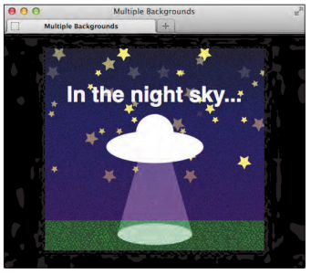

## 使用渐变背景

通过它可以在不使用图像的情况下创建从一种颜色到另一种颜色的过渡

```html
<body>
	<div class="vertical-down"><p>default</p></div>
    
	<div class="vertical-up"><p>to top</p></div>
	<div class="horizontal-rt"><p>to right</p> </div>
... 某类div的其余代码  ...
</body>
```

```css
.vertical-down { 
    /* 默认 */
    background: silver; /* 备用 */  
    background: linear-gradient(silver, black);
} 

.vertical-up {
    background: silver;
    background: linear-gradient(to top, silver, black);	/* 从下到上 */
}
```

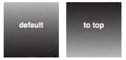

CSS渐变是个背景图像，所以其实可以是`background`也可以是`background-image`。

除了`to top`，还可以`to right`和`to left`。如果要朝着向左上右下这样子的，也可以`to top left`和`to bottom right`

还可以指定渐变角度是用`deg`作为单位：`120deg`表示120度数

径向渐变

```css
.radial-center { 
    /* 默认  */ 
    background: red; 
    background: radial-gradient(yellow, red);	/* 黄色中心 渐变成红色 */
}

.radial-top {
    background: red; 
    background: radial-gradient(at top, yellow, red);	/* 指定中心位置在上面 */
}
```


还可以控制渐变尺寸

```css
.radial-size-1 { 
    background: red; 
    background: radial-gradient(100px 50px, yellow, red);
}

.radial-size-2 { 
    background: red; 
    background: radial-gradient(70% 90% at bottom left, yellow, red);
}
```

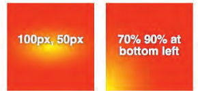

还可以指定多个渐变颜色

```css
.radial-various-1 { 
    background: red;  
    /* closest-side决定了渐变的尺寸 告知浏览器从中心向包含该渐变的区域的最近的一边伸展 */
    background: radial-gradient(closest-side at 70px 60px, yellow, lime, red);
}

.radial-various-2 { 
    background: red; 
    /* 告知浏览器从中心(指定为at 70px 60px)向包含该渐变的区域的最近的一边伸展 */
    background: radial-gradient(30px 30px at 65% 70%, yellow, lime, red);
}
```

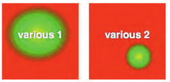

还可以用百分数指定一个以上的颜色停止位置：

```css
.color-stops-1 { 
    background: green;  
    background: linear-gradient(yellow 10%, green);
}

.color-stops-2 { 
    background: green; 
    background: linear-gradient(to top right, yellow, green 70%, blue);
}
```

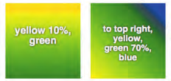

[对最新浏览器的支持情况，参见](http://caniuse.com/#search=gradient)

可以给一个背景定义多个渐变，每个定义之间是用逗号分隔。通过定义多个渐变，可以创造很多效果。

## 为元素设置不透明度

`opacity`属性和是用`RGBA`或`HSLA`设置的alpha透明背景色是不同的概念。`opacity`影响的是整个元素(包含文本图片)，而`background-color:rgba(128,0,64,.6)`只影响背景透明度。

```css
选择器 {
    opacity: .5;			/* 不透明度值0.5 即50% 值越低越透明 */
    /* 以下是针对旧版IE应用IE专有滤镜设置不透明度的代码 */
	-ms-filter: progid:DXImageTransform.Microsoft.Alpha(opacity=50);
	filter: alpha(opacity=50);		/* 也是50%的意思 */
    zoom: 1;
}
```

## 生成内容的效果

`:before`和`:after`伪元素可以和`content`属性结合使用，从而创建所谓的**生成内容**(generated content)。

生成内容指的是通过CSS创建的内容，而不是由HTML生成的。

比如给每个地方添加一个共同的文本：

```css
选择器:after {
    content: " >>";
}
```

然后选择器选中的地方就会多出的个`>>`文本。

[更多的用法](https://css-tricks.com/pseudo-element-roundup/)

[使用边框样式创建三角形](http://appendto.com/blog/2013/03/pure-css-triangles-explained/)

[创建CSS三角形代码工具](http://cssarrowplease.com/)

## 使用sprite拼合图像

可以通过把多个图像合成单个背景图像(sprite)，再通过CSS控制具体显示图像的那一部分来加快页面的加载速度。

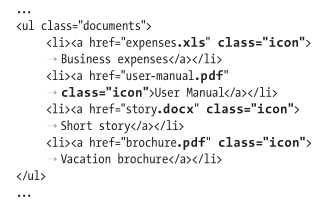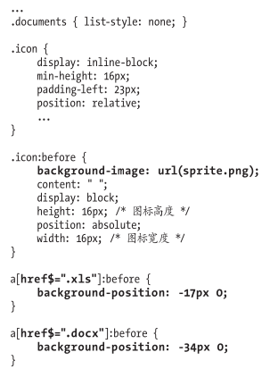

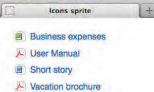

不一定要用`:before`或`:after`也可以把sprite背景直接用在元素本身。

