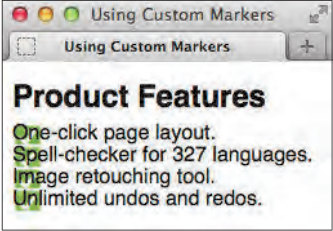
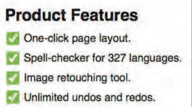
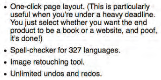
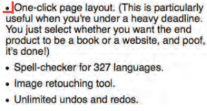
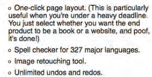
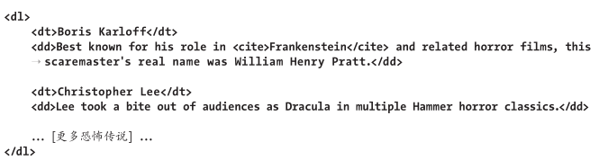
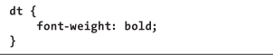
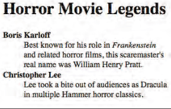

# 列表

## 创建有序列表和无序列表

有序`ol`，无序`ul`

在一个列表中创建另外一个列表：**嵌套列表**(nesting list)

## 选择标记

```css
li 或 ul(继承给li) 或 ol(继承给li) {
    list-style-type: disc;			/* 实心圆 */
    list-style-type: circle;		/* 空心圆 */
    list-style-type: square;		/* 实心正方形 */
    
    list-style-type: decimal;		/* 阿拉伯数字 */
    list-style-type: upper-alpha;	/* 大写字母 */
    list-style-type: lower-alpha;	/* 小写字母 */
    list-style-type: upper-roman;	/* 大写罗马数字 */
    list-style-type: lower-roman;	/* 小写罗马数字 */
    .../* 还有很多标记可以用 不过不同浏览器支持情况不同 */
    
    list-style-type: none;			/* 无标记列表 */
}
```

也可以直接在HTML中通过`type`属性给有序列表制定标记类型：

```html
<ol type="I"> <!-- 显式大写罗马数字 -->
```

## 使用定制的标记

```css
ul 或 ol {
    /* 取消默认标记 */
    list-style: none;
    
    /* 删除列表项的缩进 */
    margin-left: 0;
    padding-left: 0;
}

li {
    /* 显式定制的标记 */
    background: url(图片链接)
}
```



```css
ul {
	list-style: none;
	margin-left: 0;
	padding-left: 0;
}

li {
  /*  让图像在列表项目内显示的位置稍微往下一些  */
	background: url(图片链接);
    
	/* 让行高变大，从而可以容纳整个标记  */
	line-height: 1.8;
	
    /* 将文本推开，为标记腾出位置  */
	padding-left: 1.75em;
}
```



大多数浏览器是通过`padding-left`为列表设置默认缩进的，但旧浏览器(如IE8-之前版本)则是通过`margin-left`设置的。

## 选择列表的起始编号

```html
<ol start="2">
    <li>这是2</li>
    <li value="5">这是5</li>
</ol>
```

## 控制标记的位置

默认列表会从父元素的左侧进行缩进。

标记可以在文本框外，也可以在文本框内。



```css
ul { 
    /* 让标记缩在文本块内 除了inside也可以指定outside 但outside是默认值 也就是上图的效果 */
    list-style-position: inside;
}
```



## 同时设置所有的列表样式属性

简写：

```css
ul {
    /* 
    列表显式空心圆
    让文本缩进在文本块内 
    */
    list-style: circle inside;	
}
```



## 设置嵌套列表的样式

```css
ol ol ol {
    /* 给ol下的ol下的ol设置列表序号样式为阿拉伯数字 */
    list-style-type: decimal;
}
```

## 创建描述列表

HTML提供了专门用于描述成组出现的名称及其值之间关联的列表类型。

这种类型在HTML5中称之为**描述列表**(description list)，而在HTML的早期中称为定义列表。

HTML5规范：由名称及其构成的组合可以是术语和定义、元数据主题和值、问题和答案，以及任何其它的名-值组。每个列表都包含在`dl`中，其中的每个名-值组都有一个或者多个`dt`元素(名称或术语)，以及一个或者多个`dd`元素(值)。





