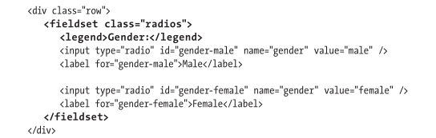

# 表单

## HTML5对表单的改进


## 创建表单

**控件**(control)：每个空间都有一个`name`属性，用于在提交表单时对数据进行识别。

**字段**(field)

`form`的重要属性：

- `action`：访问者提交表单时服务器对数据进行处理的脚本的URL
- `method`：`get`或`post`

## 处理表单

[保护表单](http://www.htmlcssvqs.com/8ed/form-security)

## 对表单元素进行组织

如果表单上有很多信息需要填写，可以用`fieldset`元素把相关元素组合在一起，使表单更容易理解。表单越好理解，访问者就越可能填对。

可以用`legend`元素对每个`fieldset`提供一个标题(caption)，用于描述每个组的目的，有时这些描述还可以用`h1`到`h6`的标题。




浏览器会默认给每个`fieldset`添加一个边框，`Public Profile`里面嵌套的`Gender`也有边框。

`legend`元素可以提供表单的可访问性。对于每个表单字段，屏幕阅读器都会将与之关联的`legend`文本念出来，使访问者了解字段的上下文。具体的行为看屏幕阅读器。

总之对于单选按钮最好一直用`fieldset`和`legend`

## 创建文本框

```html
<label for="idlabel">First Input:</label> <input type="text" name="用于让服务器识别" />
```

| 可选属性      | 属性值                          | 含义                                                         |
| ------------- | ------------------------------- | ------------------------------------------------------------ |
| `id`          | `idlabel`                       | 跟具有显示文本框的label元素关联                              |
| `value`       | `default`                       | 该字段最初显示的数据 如果没有改就会在提交的时候提交该值      |
| `placeholder` | `hinttext`                      | 最初显示的数据，当获得焦点时这些字会消失                     |
| `required`    | `required`                      | 仅字段有值时才能提交                                         |
| `autofocus`   | 可以没有，有的话得是`autofocus` | 若这是第一个拥有此属性的表单控件 那么页面加载时该字段会默认会的焦点 |
| `size`        | 数字                            | 文本框大小，也可以用CSS设置宽度，默认`20`                    |
| `maxlength`   | 数字                            | 最大允许输入字符数                                           |

`<label for="idlabel">First Input:</label>`是可选的，不过最好是有。对提升表单的可访问性和可用性有很重要的作用。

## 为表单组件添加说明标签

**标签**(label)

如果`label`的`for`属性和表单字段的`id`相同，那么就显式地关联起来了。对表单的可用性和可访问性都有帮助。

## 创建密码框

```html
<label for="password">Password:</label>
<input type="password" id="password" name="password" />
```

| 可选属性    | 值                            | 含义               |
| ----------- | ----------------------------- | ------------------ |
| `size`      | 数字                          | 密码框宽度         |
| `maxlength` | 数字                          | 密码最大长度       |
| `required`  | 可选，若有则必须是`required`  | 仅字段有值才能提交 |
| `autofocus` | 可选，若有则必须是`autofocus` | 默认焦点           |

## 创建电子邮件框和搜索框和电话框和URL框

```html
<form role="search"> <!-- 设置ARIA地表角色，使屏幕浏览器指出网页上有搜索区域 -->
    <p class="row">
    	<label for="email">Email:</label>
    	<input type="email" id="email" name="email" class="field-large" />
	</p>

	<div class="row">
    	<label for="website">Website URL:</label>
    	<input type="url" id="website" name="website" class="field-large" placeholder="http:/ /www.example.com" />
    	<p class="instructions">
        	Have a site or a blog? Put the address here, beginning with
        	<kbd>http://</kbd> or <kbd>https://</kbd>.
    	</p>
	</div>

	<p class="row">
    	<label for="phone">Phone:</label>
    	<input type="tel" id="phone" name="phone" class="field-large" placeholder="xxx-xxx-xxxx" pattern="\d{3}-\d{3}-\d{4}" />
	</p>
    
    <label for="search">Search:</label>
	<input type="search" id="search" name="search" size="30" placeholder="e.g., a book or magazine" />
 	<input type="submit" value="Find It!" />
    
</form>
```

可选的属性和密码框类似

默认给Chrome、Safari和Mobile Safari等浏览器中地搜索框设置样式是受到限制的。如果要消除这一约束，重新获得CSS的控制权，可以用专有的`-webkit-appearance:none;`声明，例如`input[type="search"]{ -webkitappearance: none; }`。[更多参见](http://css-tricks.com/almanac/properties/a/appearance/)

不过`appearance`属性不是官方的CSS，所以不同浏览器的行为可能不同。

## 创建单选按钮


```html
<input type="radio" name="区别" value="被选中时发送的文本" checked(表示默认选中) />
<input type="radio" name="区别" value="被选中时发送的文本" />
```

最好使用`fieldset`嵌套每组单选按钮，并用`legend`进行描述。

## 创建复选框

```html
<div class="fields checkboxes">
    <p class="row">
        <input type="checkbox" id="email-ok-msg-from-users" name="email_signup[]" value="user-emails" />   
        <label for="email-ok-msg-from-users">It is okay to email me with messages from other users. 
        </label> 
    </p>
    
    <p class="row">
        <input type="checkbox" id="email-ok-occasional-updates" name="email_signup[]" value="occasional-updates" />   
        <label for="email-ok-occasional-updates">It is okay to email me with occasional promotions about our other products.
        </label> 
    </p>
</div>
```

关键：

```html
<input type="checkbox" name="重复" value="被选中时发送给服务器的文本" checked(表示默认选择) />
<input type="checkbox" name="重复" value="被选中时发送给服务器的文本" />
```

## 创建文本区域


```html
<textarea id="关联label的for" name="dataname(让服务器和脚本识别输入数据的文本)" col="n" rows='n'/>
```

| 参数   | 值含义                 |
| ------ | ---------------------- |
| `cols` | 文本区域宽度，字符单位 |
| `rows` | 文本区域高度，行单位   |

## 创建选择框

```html
<label for="state">State:</label>
<select id="state" name="state">
	<option value="AL(选中时发给服务器的数据)">Alabama</option>
	<option value="AK(选中时发给服务器的数据)">Alaska</option>
	...
</select>
```


默认选中第一个，除非设置了`size`，否则必须选中菜单的某个

| 可选参数   | 属性值                       | 含义                                   |
| ---------- | ---------------------------- | -------------------------------------- |
| `size`     | 数字                         | 选择框高度，行单位，是`select`的属性值 |
| `multiple` | 可无，若有则必须是`multiple` | 表示允许多选，是`select`的属性值       |
| `selected` | 可无，若有则必须是`selected` | 表示默认选中，是`option`的属性值       |

### 对选择框进行分组

在希望放在同一子菜单里的第一组选项里的第一个`option`元素前，输入`<optgroup label="子菜单标题">`

在该组的最后一个`option`元素之后输入`</optgroup>`


如果添加了`size`属性，那么选择框看起来会更像一个列表， 且没有自动选中的选项。如果`size`大于选项的数量，访问者就可以通过点击空白区域让所有的选项处于未选中状态

## 让访问者上传文件

```html
<form method="post" action="upload.url" enctype="multipart/form-data" >
    <input type="file" name="dataname(用于识别将要上传的文件)" />
</form>
```

| 属性       | 值                           | 含义                                                |
| ---------- | ---------------------------- | --------------------------------------------------- |
| `enctype`  | `multipart/form-data`        | 可以确保文件采用正确的格式上传                      |
| `size`     | 数字                         | 访问者可以输入路径和文件名的字段的长度，`input`属性 |
| `id`       | 之前说过很多遍了             |                                                     |
| `multiple` | 可选，若有则必须是`multiple` | 表示用户可以上传一个以上的文件                      |

上传文件的表单不能用`get`方式

## 创建隐藏字段

可以认为是不可见的文本框，通常用于存储先前的表单收集的信息，以便把这些信息和当前表单的数据一起交给脚本进行处理。

```html
<input type="hidden" name="step" value="6" />
```

访问者不会看到这个输入框，但是提交表单的时候，会带着`step`和值`"6"`一起传给服务器

创建访问者可见但是不能修改的表单元素，有两种方法：

- 一种是用`disabled`(禁用)属性。后面会说
- 一种是`readonly`(只读)属性。可以获得焦点，可以选择和复制其中内容，但是不可修改，只能应用于文本输入框和文本区域。

## 创建提交按钮

```html
<input type="submit" value="提交" />
```

这里的`value`只是作为按钮显示的内容，没有其它意义。

| 可选属性         | 属性值                                                       |
| ---------------- | ------------------------------------------------------------ |
| `src`            | 图片链接                                                     |
| `alt`            | 当图片无法显示时候出现的文本                                 |
| `formnovalidate` | 如果有，就取消表单中那些`type="email"`和`type="URL"`的验证功能 |

其实不一定非要是`input`，也可以是`button`等可以点到的。但是大多时候要么是`input`要么是`button`


## 重置按钮

```html
<input type="reset" />

<button type="reset">
    Reset
</button>
```

上面两个都行

## 禁用表单元素

给需要禁用的控件添加`disabled`属性，就可以禁用

## 根据状态为表单设置样式

| 选择器      | 应用                                                         | 浏览器支持情况        |
| ----------- | ------------------------------------------------------------ | --------------------- |
| `:focus`    | 获得焦点的字段                                               | IE8+及其他            |
| `:checked`  | 选中的单选按钮或复选框                                       | IE9+及其他            |
| `:disabled` | 具有`disabled`属性的字段                                     | IE9+及其他            |
| `:enable`   | 与`:disabled`相反                                            | IE9+及其他            |
| `:required` | 具有`required`属性的字段                                     | IE10+、Safari5+及其他 |
| `:optional` | 与`:required`相反                                            | IE10+、Safari5+及其他 |
| `:invalid`  | 其值与`pattern`属性给出的模式不匹配的字段；<br />或值不是有效<br/>电子邮件格式的电子邮件框，值不是有效URL格式的URL框，<br/>以及任何标记为`required`但值为空的字段 | IE10+、Safari5+及其他 |
| `:valid`    | 与`:invalid`相反                                             | IE10+、Safari5+及其他 |

```css
/* 给任意获得焦点的input(包括submit)或者textare添加背景色 */
input:focus,
textarea:focus {
    background-color: greenyellow;
}
```

页面一开始加载就会应用`:invalid`状态，所以如果设置了，可能会出现一些意外结果。为了将必填字段排除在该规则之外，可以用`:not`伪类，如`input:invalid:not(:required) { border: 2px solid red; }`

除了IE9-，都支持`:not`伪类。


Keith Clark的[Selectivzr](http://selectivizr.com/)是一个用于让旧浏览器理解这些选择器的JavaScript文件

