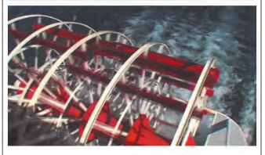
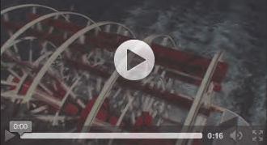

# 视频和音频和其它多媒体

## 第三方插件和步入原生

### 数字版权管理(DRM)

在嵌入音频和视频文件的过程中，你一定注意到了这样一个事实——所有人都看得见指向源文件的URL，从而利用它下载并“盗取”你的内容，就像嵌入的图像以及 HTML、JavaScript和CSS源文件一样。对此我们毫无办法。

如果在意对媒体文件的保护，就暂时不要用HTML5原生多媒体。

## 视频文件格式

HTML5支持三种视频文件格式(也就是编解码器)：

- Ogg Theora使用的文件扩展名为`.ogg`或`.ogv`
- MP4(H.264)使用的文件扩展名为`.mp4`或`.m4v`
- WebM使用的文件扩展名为`.webm`

**编解码器**是使用压缩算法对数据的数字流进行编码和解码，使之更适合播放的计算机程序。编解码器的目标通常是在保证音频和视频所能达到的最高质量的情况下减小文件尺寸。不同的编解码器的表现不同。

有的浏览器如果没有设置对**MIME**类型，媒体文件就不会播放。如果网站运行在Apache Web服务器上，可以通过`.htaccess`文件设置MIME类型。它是个文本文件，通常和主页一起位于网站的根目录。

这是可以在`.htaccess`文件中添加的MIME类型(使用文本编辑器编辑该文件)：

```
AddType video/ogg .ogv
AddType video/mp4 .mp4
AddType video/webm .webm
AddType audio/ogg .ogg
AddType audio/mp3 .mp3
```

如果已有该文件，将其命名为`.htaccess`，在里面添加上述MIME类型。

开发者至少要给视频提供两种格式，才能确保获得所有兼容HTML5的浏览器的支持。

## 在网页中添加单个视频

```html
<video src="视频文件"></video>
```



| 属性       | s值  | 含义                                                         |
| ---------- | ---- | ------------------------------------------------------------ |
| `src`      | 文件 | 指定视频文件的URL                                            |
| `autoplay` | 布尔 | 当视频可以播放时立即开始播放                                 |
| `controls` | 布尔 | 添加浏览器为视频设置的默认控件                               |
| `muted`    | 布尔 | 让视频静音                                                   |
| `loop`     | 布尔 | 让视频循环播放                                               |
| `poster`   | 文件 | 指定视频加载时要显示的图像(默认显示视频第一帧)。接受所需图像文件的URL |
| `width`    | 数值 | 视频像素宽度，默认300                                        |
| `height`   | 数值 | 视频像素高度，默认150                                        |
| `preload`  |      | 告诉浏览器要加载的视频内容的多少。可以是以下三个值：<br />`none`表示不加载任何视频<br />`metadata`表示仅加载视频的元数据(如长度、尺寸等)<br />`auto`表示让浏览器决定怎样做(这是默认的设置) |

## 为视频添加控件和自动播放

```html
<video src="视频文件" controls width="369" height="208"></video>
```



## 使用多种来源的视频和备用文本

要获得所有兼容HTML5的浏览器的支持，至少要提供MP4和WebM格式的视频

```html
<video width="369" height="208" controls>
    <source src="paddle-steamer.mp4" type="video/mp4">
    <source src="paddle-steamer.webm" type="video/webm">   
    <p>
        <a href="paddle-steamer.mp4">Download the video</a>
    </p>
</video>
```

浏览器会加载第一个它支持的`source`元素引用的文件格式，并忽略其它的来源。无法播放HTML5视频的浏览器则会显示提供的消息中的备用链接，如果有其它的内容也会显示。

| source的属性 | 值                         | 含义                                                         |
| ------------ | -------------------------- | ------------------------------------------------------------ |
| `src`        | 文件                       |                                                              |
| `type`       | 视频类型                   | 用于指定视频的类型，帮助浏览器决定它是否能播放该视频。该属性的值反映的是视频的格式，即编解码器(如video/mp4、video/webm、video/ogg) |
| `media`      | 为视频来源指定CSS3媒体查询 | 用于为视频来源指定 CSS3 媒体查询，从而可以为具有不同屏幕尺寸的设备指定<br/>不同的(如更小的)视频 |

## 提供可访问性

HTML5还指定了一种新的文件格式WebVTT(Web Video Text Track，Web视频文件轨道)用于包含文本字幕、标题、描述、篇章等视频内容。[参见](http://www.iandevlin.com/blog/2011/05/html5/webvtt-and-video-subtitles/)

## 音频文件格式

- Ogg Vorbis的`.ogg`
- MP3的`.mp3`
- WAV的`.wav`
- AAC的`.aac`
- MP4的`.mp4`
- Opus的`.opus`

音频最好是用Ogg Vorbis和MP4

## 在网页中添加带控件的单个音频文件

```html
<audio src="音频文件" controls></audio>
```

| 音频属性   | 值   | 含义                                                         |
| ---------- | ---- | ------------------------------------------------------------ |
| `src`      | 文件 |                                                              |
| `autoplay` | 布尔 | 自动播放                                                     |
| `controls` | 布尔 | 控件                                                         |
| `muted`    | 布尔 | 静音                                                         |
| `loop`     | 布尔 | 循环播放                                                     |
| `preload`  | 右边 | 告诉浏览器要加载的音频内容的多少。<br />`none`表示不加载任何音频<br />`metadata`表示仅加载音频的元数据(如长度)<br />`auto`表示让浏览器决定怎么做(默认) |

## 带备份内容的多个音频源

```html
<audio controls>
    <source src="piano.ogg" type="audio/ogg">
    <source src="piano.mp3" type="audio/mp3">
    <p>
        Your browser doesn't support HTML5 audio, but you can
        <a href="piano.mp3">download the audio file</a> 
        (MP3, 1.3 MB).
    </p>
</audio>
```

## 高级多媒体

使用canvas元素及相应的JavaScript API可以在网页上描绘动画。

可以对HTML5视频应用这些API，因为video元素可以和其它HTML元素一样进行处理，所以它也可以被canvas访问和获取。

通过JavaScript API，可以从播放的视频中抓取图像，并在canvas元素中重新绘制该图像，从而创建视频的截图。

通过API可以对单个图像像素进行操作，同时由于可以根据视频在canvas中创建图像因而可以调整视频的像素。例如，可以将视频转化为灰度模式。