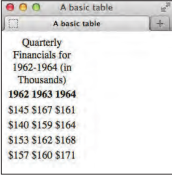
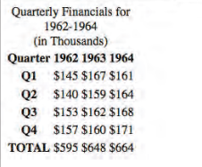
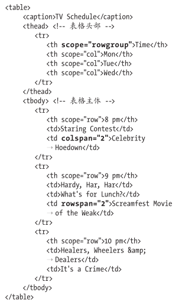
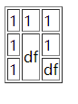

# 表格

复杂表格示例：

- https://www.456bereastreet.com/archive/200410/bring_on_the_tables/
- http://usability.com.au/2005/06/accessible-data-tables-2005/
- http://accessiblehtml.sourceforge.net/

## 结构化表格

如果觉得给表格整个标题可以帮助访问者理解该表格，可以加个`caption`。

`scope`属性可以告诉屏幕阅读器或其他辅助设备当前的`th`是列的标题单元格(`scope="col"`)还是行的标题单元格(`scope="row"`)，或者是用于其它目的的单元格。

示例一：

```html
<table>
	<caption>Quarterly Financials for 1962-1964 (in Thousands)</caption>
	<tr>
		<th scope="col">1962</th>
		<th scope="col">1963</th>
		<th scope="col">1964</th>
	</tr>
	
    <tr>
        <td>$145</td>
        <td>$167</td>
        <td>$161</td>
	</tr>
 
    <tr>
        <td>$140</td>
        <td>$159</td>
        <td>$164</td>
	</tr>
 
    <tr>
        <td>$153</td>
        <td>$162</td>
        <td>$168</td>
	</tr>
 
    <tr>
        <td>$157</td>
        <td>$160</td>
        <td>$171</td>
	</tr>
</table>
```



示例二：

```html
<table>
    <caption>Quarterly Financials for 1962-1964 (in Thousands)</caption> 
    
    <thead> <!-- 表格头部  -->
        <tr>
            <th scope="col">Quarter</th>
            <th scope="col">1962</th>
            <th scope="col">1963</th>
            <th scope="col">1964</th>
        </tr>
    </thead>
    
    <tbody> <!-- 表格主体  -->  
        <tr>
            <th scope="row">Q1</th>
            <td>$145</td>
            <td>$167</td>
            <td>$161</td>
        </tr>
        <tr>
            <th scope="row">Q2</th>
            <td>$140</td>
            <td>$159</td>
            <td>$164</td>
        </tr>  
        ... [Q3 and Q4 rows] ... 
    </tbody> 
    
    <tfoot> <!-- 表格尾部  --> 
        <tr>   
            <th scope="row">TOTAL</th> 
            <td>$595</td> 
            <td>$648</td> 
            <td>$664</td> 
        </tr>
    </tfoot>
    
</table>
```



应用样式：

```css
body {  
    font: 100% "Courier New", Courier, monospace;
}

table { 
    border-collapse: collapse;
}

caption { 
    font-size: .8125em; 
    font-weight: bold;
    margin-bottom: .5em;
}

th,td { 
    font-size: .875em; 
    padding: .5em .75em;
}

td {
    border: 1px solid #000;
}

tfoot {
    font-style: italic; 
    font-weight: bold;
}
```


## 让单元格跨越多列或多行

### 跨多列

单元格添加属性`colspan="需要跨的列数目"`




### 跨多行

单元格添加属性`rowspan="需要跨的行数目"`

```html
<!DOCTYPE html>
<html>
	<head>
		<meta charset="utf-8">
		<title></title>
	</head>
	<body>
		<table border="1">
			<tr>
				<td>1</td>
				<td>1</td>
				<td>1</td>
			</tr>
			<tr>
				<td>1</td>
				<td rowspan="3">df</td>
				<td>1</td>
			</tr>
			<tr>
				<td>1</td>
				<td>df</td>
			</tr>
		</table>
	</body>
</html>

```



