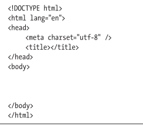
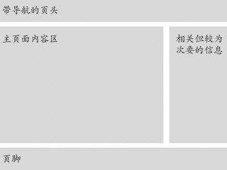

# 基本HTML结构

## 开始编写网页

### 编写HTML5页面开头的步骤



```html
<!DOCTYPE html>
```

声明页面为HTML5文档。

```html
<html lang="language-code"></html>
```

`language-code`指使用页面默认语言，有如`es`、`en-US`

```html
<meta charset="utf-8" />
```

将文档的字符编码声明为UTF-8

```html
<title></title>
```

页面标题

```html
<body></body>
```

页面主题

在文档 head 部分，通常要指明页面标题，提供为搜索引擎准备的关于页面本身的信息，加载样式表，以及加载 JavaScript 文件（不过，出于性能考虑，多数时候在页面底部`</body>`标签结束前加载 JavaScript 是更好的选择）。

搜索引擎可能会根据`lang`属性指定的语言区分搜索结果

## 创建页面标题

```html
<title>标题文字</title>
```

要在指定字符编码的`meta`后面

建议将 title 的核心内容放在前 60 个字符（含空格）中，因为搜索引擎通常将超过此数目（作为基准）的字符截断。

## 创建分级标题

```html
<h1></h1>
...
<h6></h6>
```

## 普通页面构成



## 创建页眉

如果页面中有一块包含一组介绍性或导航性内容的区域，应该用`header`元素对其进行标记。

## 标记导航

`nav`中的链接可以指向页面中的内容，也可以指向其他页面或资源，或者两者兼而有之。 无论是哪种情况，应该仅对文档中重要的链接群使用`nav`。

HTML5 不允许将`nav`嵌套在`address`元素中。

HTML5 规范不推荐对辅助性的页脚链接（如“使用条款”、“隐私政策”等）使用`nav `，这不难理解。不过，有时页脚会再次显示顶级全局导航，或者包含“商店位置”、“招聘信息”等重要链接。在大多数情况下，我们推荐将页脚中的此类链接放入`nav`中。

## 标记页面的主要区域

一个页面只有一个部分代表其主要内容。可以将这样的内容包在`main`元素中，该元素在一个页面仅使用一次

不能将`main`放置在`article `、`aside `、`footer`、`header`或`nav`元素中。

## 创建文章

`article`元素表示文档、页面、应用或网站中一个独立的容器，原则上是可独立分配或可再用的，就像聚合内容中的各部分。

## 定义区块

`section`元素代表文档或应用的一个一般的区块。在这里， `section`是具有相似主题的一组内容，通常包含一个标题。

`section`的例子包含章节、标签式对话框中的各种标签页、论文中带编号的区块。比如网站的主页可以分成介绍、新闻条目、联系信息等区块。

从语义上讲，`section`标记的是页面中的特定区域，而`div`则不传达任何语义。

## 指定附注栏

有时候，页面中有一部分内容与主体内容相关性没有那么强，但可以独立存在，在 HTML5 中，我们可以使用`aside`元素。

使用`aside`的例子还包括重要引述、侧栏、 指向相关文章的一组链接、广告、 如博客的友情链接，Twitter 源、相关产品列表，等等。

在HTML中，应该将附注栏内容放在`main`的内容之后。

HTML5不允许将`aside`嵌套在`address`元素内。

## 创建页脚

当你想到页脚的时候，你大概想的是页面底部的页脚（通常包括版权声明，可能还包括指向隐私政策页面的链接以及其他类似的内容）。HTML5的`footer`元素可以用在这样的地方，但它同`header`一样，还可以用在其他的地方。

footer 元素代表嵌套它的最近的`article`、`aside`、`blockquote`、`body`、`details`、`fieldset`、`figure`、`nav`、`section`或`td`元素的页脚。只有当它最近的祖先是`body`时，它才是整个页面的页脚

## 创建通用容器

有时需要在一段内容外围包一个容器，从而可以为其应用CSS样式或JavaScript效果。

这个容器就是`div`。`div`是一个通用容器，一个完全没有任何语义含义的容器。

`div`是块级内容的无语义容器，`span`是短语内容的无语义容器。

## 使用ARIA改善可访问性

WAI-ARIA（_Web Accessibility Initiative’s Accessible Rich Internet Applications_，无障碍网页倡议–无障碍的富互联网应用，也简称ARIA）是一种技术规范。

无障碍访问的意义是让所有的访问者都能获取网站的内容。你的网站的一部分访问者可能需要借助辅助设备（如屏幕阅读器）访问你的页面内容。

**地标角色**

ARIA填补了HTML的语义空白。例如，如果你想让屏幕阅读器用户知道如何跳至页面级的页脚，应该使用什么HTML标记呢？标记为footer还不够，要知道页面可以包含多个footer 。

对此，HTML没有解决方案，而 ARIA的地标角色（landmark role）则可以满足需求。地标角色可以帮助用户识别页面区域，从而让屏幕阅读器用户可以直接跳到这些区域。通常，对这些区域指定`role`属性就可以了。

试用屏幕阅读器：

- www.free-domscientific.com
- www.nvda-project.org
- www.gwmicro.com

地标角色只是ARIA规范众多特性中的一个。

## 为元素指定类别或者ID名称

为元素指定类别：`class="name"`

为元素添加ID：`id="name"`

推荐使用类为元素添加样式

HTML文档中说每个`id`都必须唯一。

`class`名称可以分配给页面中任意数量的元素，且一个元素可以有多个`class`。

元素可以同时拥有`id`和`class`。

在`class`和`id`名称中，通常使用短横线分隔多个单词，例如`class="footer-page"`。

## 为元素添加title属性

加上它们之后屏幕阅读器可以为用户朗读`title`文本，因此使用`title`可以提升无障碍访问功能。

常用于链接。

## 添加注释

```html
<!--注释内容-->
```

注释不能嵌套在其他注释里。

