# 文本

## 添加段落

要在网页中新开段落应用`p`元素。

## 指定细则

HTML5中`small`表示细则一类的旁注(side comment)，常用于表示免责声明、注意事项、法律限制、版权信息等。

`small`常是行内文本中的一小块。

```html
<small>细则</small>
```

一些浏览器会把细则文本显示为小字号。

## 标记重要和强调的文本

`strong`元素表示内容的重要性，而`em`表示内容的着重点。根据内容，可以单独用也可以一起用。

不要用`b`替代`strong`也不要用`i`替代`em`。它们语义不一样。

> HTML5将`b`重新定义为：
>
> `b`元素表示出于实用目的提醒读者注意的一块文字，不传达任何额外的重要性，也不表示其他的语态和语气，用于如文档摘要里的关键词、评论中的产品名、基于文本的交互式软件中指示操作的文字、文章导语等。
>
> 
>
> HTML5将`i`重新定义为：
>
> `i`元素表示一块不同于其他文字的文字， 具有不同的语态或语气， 或其他不同于常规之处，用于如分类名称、技术术语、外语里的惯用语、翻译的散文、西方文字中的船舶名称等。

## 创建图

通过引入`figure`和`figcaption`，HTML5改变了这种情况。图可以是图表、照片、
图形、插图、代码片段，以及其他类似的独立内容。

1. `<figure>`
2. 可选步骤，输入`<figcaption>`开始图的标题，然后`</figcaption>`
3. 添加图像、视频、数据表格等内容的代码创建图。
4. 可以再重复第二步
5. `</figure>`

示例：

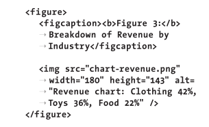

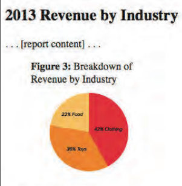

 `figcaption`元素并不是必需的，但如果包含它，它就必须是`figure`元素内嵌的第一个或最后一个元素。

## 指明引用或参考

使用`cite`元素可以指明对某内容源的引用或参考。例如，戏剧、脚本或图书的标题等。

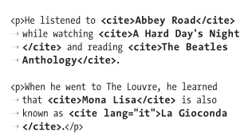

最后的`lang="it"`表名该`cite`文本语言是意大利语。

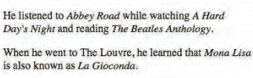

要弄清楚的是，`cite`只用于参考源本身，而不是从中引述的内容。

HTML5 声明，不应使用`cite`作为对人名的引用。

## 引述文本

`blockquote`元素表示单独存在的引述（通常更长，但也可能不是），它默认显示在新的一行。

而`q`元素则用于短的引述，如句子里面的引述。

如果要添加署名，署名应该放在`blockquote`外面。可以把署名放在`p`里面，不过使用`figure`和`figcaption`可以更好地将引述文本与其来源关联起来

浏览器应对`q`元素中的文本自动加上特定语言的引号，但不同浏览器的效果并不相同。

浏览器默认对`blockquote`文本进行缩进，`cite`属性的值则不会显示出来。

引述块级文本：

1. 输入`<blockquote>`开始一个块级引述
2. 如果需要就加入`cite="url"`属性表示引述来源
3. 引述文本
4. `</blockquote>`

引述行内文本：

1. `<q>`
2. 如果需要就加入`cite="url"`属性表示引述来源
3. 引述文本
4. `</q>`

不要仅仅因为需要在字词两端添加引号就使用`q`。

## 指定时间

可以使用`time`元素标记时间、日期或时间段，这是HTML5新增的元素。

可以给`time`标签提供`datetime`属性，该属性需要遵守特定格式。

```
YYYY-MM-DDThh:mm:ss
年-月-日(DD)上午或是下午(T)小时(hh):分:秒
```

小时部分为24小时制。如果包含时间，秒是可选的，也可以`hh:mm.sss`提取时间的毫秒数。

也可以设置成为全球日期和时间及时差：

末尾加上字母Z，就成了UTC标准时间。如：`1985-11-03T17:19:10Z`

也可以通过相对UTC时差的方式表示时间。加上`-`或`+`及时差即可，如`1985-11-03T17:19:10-03:30`，表示NST标准时，因为NST比UTC晚3个半小时。

浏览器只显示`time`元素的文本内容，而不会显示`datetime`的值

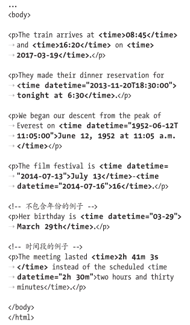

如果忽略`datetime`属性，文本内容就必须是合法的日期或时间格式。

`datetime`属性不会单独产生任何效果，但它可以用于在Web应用（如日历应用）之间同步日期和时间。

## 解释缩写词

可以使用`abbr`元素标记缩写词并解释其含义。

使用可选的`title`属性提供缩写词的全称。也可以将全称放在缩写词后面的括号里。 

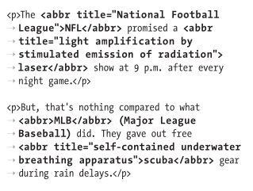

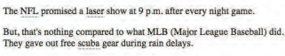

通常，仅在缩写词第一次出现在屏幕上时给出其全称。

## 定义术语

在HTML中定义术语时，可以使用`dfn`元素对其作语义上的区分。仅用`dfn`包围要定义的术语，而不是包围定义。

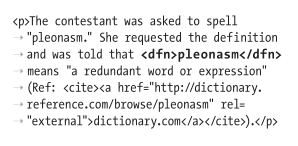

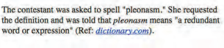

通常，`dfn`元素默认以斜体显示，与`cite`一样。

HTML5规范述：“如果一个段落、描述列表或区块是某`dfn`元素距离最近的祖先，那么该段落、描述列表或区块必须包含该术语的定义。

## 创建上标和下标

`sub`元素创建下标

`sup`元素创建上标

上标和下标字符会轻微地扰乱行与行之间均匀的间距。

### 修复使用sub和sup时的行间距问题

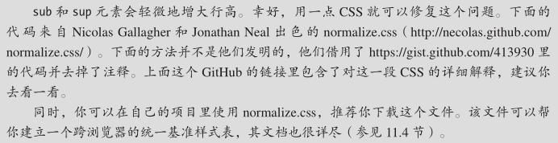

```css
/* 
 在所有浏览器中防止sub和sup影响line-height
 gist.github.com/413930
 */
sub,sup{
	font-size: 75%;
	line-height: 0;
	position: relative;
	vertical-align: baseline;
}
sup{
	top: -0.5em;
}
sub{
	bottom: -0.25em;
}
```

## 添加作者联系信息

`address`元素是用以定义与HTML页面或页面一部分（如一篇报告或新文章）有关的作者、相关人士或组织的联系信息，通常位于页面底部或相关部分内。

### 提供作者联系信息

1. `<address>`
2. 作者的电子邮件地址、指向联系信息页的链接等
3. `</address> `

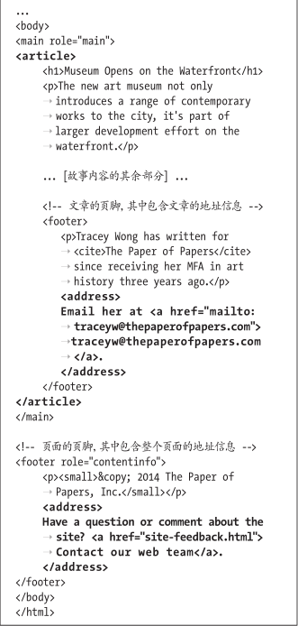


这个页面有两个`address`元素：

- 一个用于`article`的作者,这里只包含联系信息。
- 另一个位于页面级的`footer`里，用于整个页面的维护者。虽然`article`的`footer`里也有关于Tracey Wong的背景信息，但这些信息是位于`address`元素外面的

如果`address`嵌套在`article`里，则属于其所在的最近的`article`元素；否则属于页面的`body`。

## 标注编辑和不再准确的文本

有时可能需要将在前一个版本之后对页面内容的编辑 标出来，或者对不再准确、不再相关的文本进行标记。

添加内容：`int`元素

删除内容：`del`元素

不再相关或不再准确的内容：`s`元素

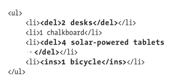

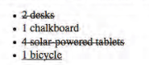

可以一起用

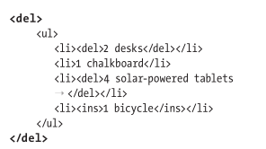

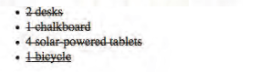

`s`元素使用：

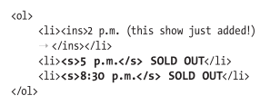

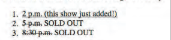

## 标记代码

如果内容包含代码示例或文件名就可以用`code`元素

如果需要显示`<`或者`>`，应该用`&lt;`或`&gt;`

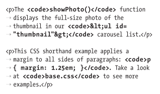

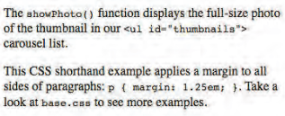

如果要显示单独一块代码，可以用`pre`元素包住`code`元素以维持其格式。

### 其他计算机相关元素

`kbd`元素

使用`kbd`标记用户输入指示：

```html
<p>To log into the demo:</p>
<ol>
	<li>Type <kbd>tryDemo</kbd> in the User Name field</li>
	<li><kbd>TAB</kbd> to the Password field and type <kbd>demoPass</kbd></li>
	<li>Hit <kbd>RETURN</kbd> or <kbd>ENTER</kbd></li>
</ol>
```

`kbd`默认以等宽字体显示

`samp`元素

用于指示程序或系统的示例输出

也是等宽字体显示

`var`元素

表示变量或占位符的值。

默认斜体显示

还可以在HTML5中使用math等MathML元素表示高级的数学相关的标记。[参见](http://dev.w3.org/html5/spec-author-view/mathml.html)

## 使用预格式化的文本

通常，浏览器会将所有额外的回车和空格压缩，并根据窗口的大小自动换行。

预格式化的文本可以保持文本固有的换行和空格。

预格式化文本元素：`pre`

预格式化的文本通常以等宽字体。

浏览器通常会对`pre`里面的内容关闭自动换行，因此，如果这些内容很宽，就会影响页面的布局，或产生横向滚动条。

## 突出显示文本

可以使用`mark `元素做出高亮效果。

## 创建换行

`<br>`或`<br />`

不要使用`br`模拟段落之间的距离。

## 创建span

无语义

`span`只适合包围字词或短语内容。

## 其他元素

### u元素

为文本添加下划线。

HTML5定义：u元素是一块文字添加明显的非文本注解，比如在中文中将文本标为专有名词，或者标明文本拼写有误。

仅在`cite`、`em`、`mark`等其他元素语义上不合适的情况下使用`u`元素。

### wbr元素

表示"一个可以换行的地方"。常用于一个较长的无间断短语，如URL中使用该元素，表示此处可以在必要的时候进行换行，从而使得文本在有限的空间里更具有可读性。

也就是`wbr`与`br`不同的地方在于`wbr`不会强制换行。

### ruby和rp和rt元素

旁注标记(ruby annotation)是东亚语言中惯用符号，常用于表示生僻字的发音。

简称旁注(`ruby`或者rubi)。日语中的旁注字符称为振假名(furigana)

`ruby`元素以及它们的子元素`rt`和`rp`是HTML5中为内容添加旁注标记的机制。`rt`指明对基准字符进行注解的旁注字符。可选的`rp`元素用于在不支持`ruby`的浏览器中的旁注文本周围显示括号。

### bdi和bdo元素

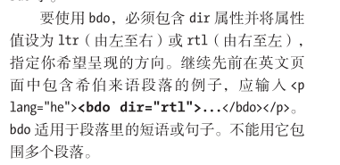

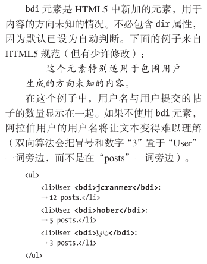

### meter元素

可以用`meter`元素表示分数的值或已知范围的测量结果。例如投票结果。

一些支持`meter`的浏览器会将其渲染成一个表示测量值的横条。

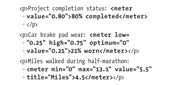

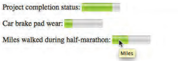

#### meter属性

- value：必须
- min：最小值，默认0
- max：最大值，默认1.0
- low：低
- high：中
- optimum：高，范围内的最优位置

如果`low`和`high`的值都不是最好的，可以把`optimum`设为它们之间的值

### progress元素

表示某项任务的完成进度。可以用于表示进度条。

#### progress属性

- max：任务的总工作量
- value：已完成的任务量

如果`progress`没有嵌套在`form`元素里，有需要把他们关联起来，可以添加`form`属性并将其值设置为那个`form`的`id`。

