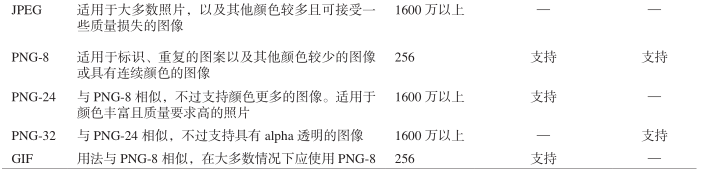

# 图像

## 关于Web图像

### 格式与下载速度

- JPEG：适用于彩色照片，包含大量颜色并进行了合理的压缩，采用这种格式保存的文件相对较小。但JPEG是一种有损格式，对其解压缩也无法还原图像丢失的细节。
- PNG和GIF：都是无损格式，都支持透明，适用于非照片类图像。优先用PNG，因为对透明的支持更好，压缩算法也更好，产生的文件也更小。
  - GIF只有256种颜色
  - PNG支持几百万中颜色。由于无损画质，所以文件会比JPEG的大。
    - PNG的分支：
      - PNG-8
      - PNG-24
      - PNG-32
- WebP：谷歌建立的图像格式。支持有损压缩也支持无损压缩，产生的文件大小也远小于JPEG和PNG，也支持透明。



### 颜色

有的图像格式的调色板是有限的。GIF和PNG-8只支持256种颜色，但是对标志和图标已经够用。

JPEG、PNG-24和PNG-32都支持超过1600万种颜色。

### 大小(尺寸)

打印机的每英寸点数(dpi)通常比显示器的每英寸像素数(ppi)要多。所以相同图像在显示器上看比纸上看要大的多。

#### 可缩放矢量图形(SVG)

使用SVG图像语言创建的图像，无论放大还是缩小都不会影响其质量。

对于某个SVG图像来说，不管它是在页面中显示的尺寸多大，文件大小都是固定的。

### 透明度

PNG和GIF都支持透明度，JPEG不支持。

GIF格式中一个像素要么透明要么不透明，称为**索引色透明**(index transparency)。

PNG支持索引色透明，也支持**alpha透明**(alpha transparency)。

alpha透明可以控制一个像素透明的程度。

PNG-8支持alpha透明需要使用Firworks类似的程序才能把图像保存为PNG-8格式。

Photoshop不支持alpha透明的PNG-8，但支持alpha透明的PNG-32.

PNG-24和PNG-32很相似，但是只有PNG-32支持alpha透明。

### 动画

动画可以保存为GIF，不能是GIF或JPEG。

但现在用CSS、JavaScript、HTML5 Canvas、SVG、Flash创建动画。

## 获取图像

知识共享许可协议：知识共享（Creative Commons，www.creativecommons.org ）是一个非营利组织，它开发了一个版权模板体系，让艺术家可以按照其指定的方式分享他们的作品，同时无需放弃对作品的所有权利。网站设计师、音乐家和摄影师使用知识共享许可协议将他们的作品放入市场，而无需担心别人以他们不允许的方式利用这些作品。

## 选择图像编辑器

略

## 保存图像

用RGB模式创建图像，而不是CMYK模式，CMYK用于印刷。

## 在页面中插入图像

```html

```

## 提供替代文本

使用`alt`属性可以让图像显示不出来的时候显示`alt`属性对应的文本。

如果图像对内容价值较小，对视障用户来说不重要，可以提供空的替代文本`alt=""`，也可以留空。

## 在浏览器中改变图像的尺寸

在`img`标签中`src`属性后，添加：

- `width`属性：宽
- `height`属性：高

加载该文件的时间与原来一样。

## 为网站添加图标

在历史记录、书签页、收藏夹和地址栏中看到的小图标称为favicon——favorites icon。

将favicon放在网站根目录里。浏览器会自动在根目录寻找这些特定的文件名，然后就会把图标显示出来。

