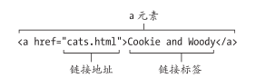

# 链接

链接有俩部分：

- **目标**(destrination)可以指定访问者点击链接触发的事件。其中连接到其他网页特定位置的事件称为**锚**(anchor)。
- **标签**(label)，即访问者在浏览器中看到或者在屏幕阅读器里听到的部分。激活标签就可以到达链接的目标。

## 创建指向另一个网页的链接

### 创建指向另一个网页的链接

```html
<a href="另一个网页的链接"></a>
```



通过键盘进行导航：每按一次`Tab`键，焦点就会转移到HTML代码中出现的下一个链接、表单控件、图像映射。

### HTML块级链接

HTML5几乎允许在链接内包含任意类型的元素或者元素组。

有时可能会以文章的一小段作为链接，指向完整的文章。

这些**块级链接**(block-level link)是HTML5与HTML5之前版本的巨大差异的地方。

但是不要过度使用块级标签。

`href`指hpertext reference(超文本引用)。

在URL中应该全部使用小写字母，除非指向的页面或者目录名称中有大写字母。

不要让链接的标签太长。

图像映射是用于为单张图像的一个或者多个区域添加链接的。

#### 如何使用target属性

尽量不要使用该属性

应该让用户绝对是否在不同的窗口或标签页中打开标签。

缺乏经验的用户在激活一个链接却没有在当前窗口看到结果可能会产生疑惑。:pensive:

使用示例：

```html
target="window"
```

`window`指应该显示相应页面的窗口的名称。

```html
<a href="page.html" target="doodad">doodad page</a>
```

会在名为`doodad`的新窗口或者页面中打开`page.html`

如果让多个链接指向同一个窗口(同一个名称)，链接就都会在同一个窗口打开。

如果想要链接在不同窗口或标签页打开可以用HTML预定义的名称：`target="_blank"`。

`target`还可以在`iframe`中打开链接。用同样的方法编写`target`只是其值应该和`iframe`的`id`对应。

## 创建锚并链接锚

### 创建锚

在希望用户跳转至的元素中输入`id="锚名"`

```html
<h2 id="mao">H2标题</a>
```

### 创建链接到锚的链接

```html
<a href="#锚名">跳转到H2标题</a>
```

应该给锚id赋有意义的名字。

锚位于另一个文档就：

```html
<a href="page.html#mao">跳转到page.html的mao锚</a>
```

## 创建其他类型的链接

可以创建指向任何URL的链接：

- RSS源
- 图像
- 希望访问者下载的文件：`<a href="文件名">文件</a>`
- 电子邮件地址：`<a href="mailto:mail@mail.com">mail@mail.com</a>`
- 电话号码：`<a href="tel:+18001234567">1(800) 123-4567</a>`

如果链接指向的文件是浏览器不知道怎么处理的类型，比如Execl文件，浏览器就会尝试打开一个辅助程序来查看这个文件。

最好不要用指向电子邮件地址的链接，因为垃圾邮件机器人会搜集这些地址并发送垃圾邮件。

应该避免链接到非HTML文档。

最好对供访问者下载的大文件和文件组进行压缩。