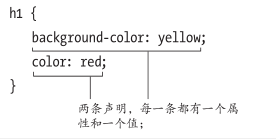

# CSS构造块

着重CSS2，但是CSS3也会有一些

## 构造样式规则

样式表中包含了定义网页外观的规则。

样式表中的每条规则都有两个主要部分：

- **选择器**(selector)：决定哪些元素受到影响
- **声明块**(declaration block)：由一个或者多个属性组成，每个属性键值对构成一条**声明**(declaration)，指明应该做什么。




声明顺序随意，除非对相同的属性定义了两次。

在样式规则中可以添加额外的空格、制表符或回车，从而提高样式表的可读性。

## 为样式规则添加注释

```css
/*注释内容*/
```

不能注释嵌套注释

## 理解继承

**继承**(inheritance)。为某个元素应用CSS属性时，还会影响其下的分支元素。

也就是子标签会继承父标签的CSS。

利用继承可以简化样式表，比如某个块设置统一的字体。

但是不是所以属性都会被继承

### 会被继承的属性

#### 文本

| CSS属性        | 含义                 |
| -------------- | -------------------- |
| color          | 颜色，`a`元素除外    |
| direction      | 方向                 |
| font           | 字体                 |
| font-family    | 字体系列             |
| font-size      | 字体大小             |
| font-style     | 用于设置斜体         |
| font-variant   | 用于设置小型大写字母 |
| font-weight    | 用于设置粗体         |
| letter-spacing | 字母间距             |
| line-height    | 行高                 |
| text-align     | 用于设置对齐方式     |
| text-indent    | 用于设置首行缩进     |
| text-transform | 用于修改大小写       |
| visibility     | 可见性               |
| white-space    | 用于指定如何处理空格 |
| word-spacing   | 字间距               |

#### 列表

| CSS属性             | 含义                     |
| ------------------- | ------------------------ |
| list-style          | 列表样式                 |
| list-style-image    | 用于为列表指定定制的标记 |
| list-style-position | 用于确定列表标记的位置   |
| list-style-type     | 用于设置列表的标记       |

#### 表格

| CSS属性         | 含义                                           |
| --------------- | ---------------------------------------------- |
| border-collapse | 用于控制表格相邻单元格的边框是否合并为单一边框 |
| border-spacing  | 用于指定表格边框之间的空隙大小                 |
| caption-side    | 用于设置表格标题的位置                         |
| empty-cells     | 用于设置是否显示表格中的空单元格               |

#### 页面设置（对于印刷物）

| CSS属性           | 含义                                                     |
| ----------------- | -------------------------------------------------------- |
| orphans           | 用于设置当元素内部发生分页时在页面底部需要保留的最少行数 |
| page-break-inside | 用于设置元素内部的分页方式                               |
| widows            | 用于设置当元素内部发生分页时在页面顶部需要保留的最少行数 |

#### 其他

| CSS属性 | 含义             |
| ------- | ---------------- |
| cursor  | 鼠标指针         |
| quotes  | 用于指定引号样式 |

## 层叠：当规则发生冲突时


编写的样式如果与浏览器的默认样式冲突， 均以编写的样式为准。 

CSS用层叠的原则来考虑**特殊性**(specificity)、**顺序**(order)和**重要性**(importance)，从而判断相互冲突的规则中哪个规则应该起作用。

### 特殊性

特殊性规则指定选择器的具体程度。选择器越特殊，规则就越强。

`id`选择器最特殊。

继承的样式是最一般的，可以被任何其他规则覆盖。

### 顺序

特殊性还不足以判断在相互冲突的规则中应该优先应用哪一个。在这种情况下，规则的顺序就可以起到决定作用：晚出现的优先级高

例如直接应用在HTML元素上的规则比外部样式表中或插在 HTML 文档顶部的特殊性相同的规则出现得更晚（因此优先级更高）。

### 重要性

如果这还不够，可以声明一条特殊的规则覆盖整个系统中的规则，这条规则的重要程度要比其他所有规则高。

在某条声明末尾加上`!important`。不建议使用这种方法。

示例：

```css
p{
    color:orange !important;
}
```

## 属性的值

### inherit

对于任何属性，如果希望显式地指出该属性的值与对应元素的父元素对该属性设定的值相同，就可以使用`inherit`值。

例如有个`article`元素，其中有很多段落。`article`元素设置了一个边框。边框通常不会被继承。但我们可以使用下述规则让段落获得相同的边框样式。

```css
p{
    border: inherit;
}
```

### 预定义的值

大多数CSS属性都有一些可供使用的预定义值。不需要（也不能）将预定义的值放在引号里。


### 长度和百分数

很多CSS属性的值是长度。所有长度都必须包含数字和单位，并且它们之间没有空格。


`em`表示字号的倍速。

应该在为打印准备的样式表中保留`pt`单位。

还可以使用百分数、`rem`和像素`px`。

###  纯数字

只有极少数的CSS属性接受不带单位的数字，如3、0.65 。


###  URL


可以在文件名上加上引号，但这不是必需的。

在单词 url 和前括号之间不应该有空格。

括号和地址之间允许有空格，但这不是必需的（通常也不这样做）。

### CSS 颜色

我们可以使用预定义颜色关键字或以十六进制（ 通 常 称 为 hex）、RGB、HSL、RGBA、HSLA 等格式表示的值中为 CSS 属性指定颜色。最后两种格式可以指定具有一定程度alpha透明度的颜色。HSL、RGBA 和HSLA 格式都是在 CSS3 中引入的。

CSS3指定了CSS2.1本来就有的16个基本的名称，另外又增加了131个。

完整的列表见 `www.w3.org/TR/css3-color/#svg-color` 。

### RGB

可以通过指定红、绿、蓝（这也是 RGB这一名称的由来）的量来构建自己的颜色。


也可以将每个值表示为百分数，不过很少用到这种做法。

```css
color: rgb(35%, 0%, 50%);
```

### 十六进制数


### 更多CSS3提供的指定颜色的方式

CSS3引入了另一种指定颜色的方式——HSL，以及通过RGBA和HSLA设置alpha透明度的能力。（使用十六进制记法无法指示 alpha 透明度。）

#### RGBA

RGBA在RGB的基础上加了一个代表alpha透明度(alpha transparency)的A。

alpha设置越接近 0，颜色就越透明。如果设为 0，就是完全透明的，就像没有设置任何颜色。


#### HSL和HSLA

HSL和HSLA也是CSS3中新增的。

HSLA是除RGBA以外为颜色设置alpha透明度的另一种方式，方法与RGBA一样。

**HSL**代表**色相**(hue)、**饱和度**(saturation)和**亮度**(lightness)。其中色相的取值范围为0～360，饱和度和亮度的取值均为百分数，范围为0～100%

不要将HSL和HSB、HSV混淆。它们很相似，但不是一回事，CSS不允许用HSB 和HSV表示颜色。

HSL语法：


HSLA语法：


