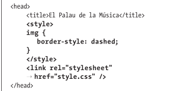
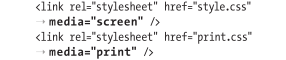
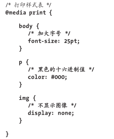

# 操作样式表

## 创建外部样式表

创建css文件

如果网站只有一个样式表文件，通常命名为`style.css`或`styles.css`。

外部样式表要么是通过链接引用的要么通过`@import`是导入的。

使用导入会影响下载速度和呈现速度。

## 链接到外部样式表

```css
<title>标题</title> 
<link rel="stylesheet" href="style.css" />
```

外部样式表的另一个好处是，一旦浏览器在某个页面加载了它，在随后浏览引用它的页面时，通常无需再向 Web 服务器请求该文件。浏览器会将它保存到缓存里，也就是保存到用户的计算机里，并使用这个版本的文件。

可以在页面中使用多个`link`元素来加载多个样式表文件。

HTML早期版本要求在`link`元素定义中包含`type="text/css"`，但HTML5不要求这样做。

## 创建嵌入样式表

在`head`部分加入`<style>样式表内容</style>`

当`style`元素出现在`link`元素后面的时候，嵌入样式表中的样式会覆盖外部样式表中的样式。

HTML5之前的版本要求在`style`开始标签中包含属性`type="text/css"`，不过HTML5没有要求。

## 应用内联样式

内联样式是在HTML中应用CSS的第三种方式。不过，应当最后考虑这种方式。因
为它将内容(HTML)和表现(CSS)混在了一起， 严重地违背了最佳实践。

```html
<p style="border: 4px solid red;color: red;">段落</a>
```

内联样式的优先级高于其他所有样式，除非其他地方与之冲突的样式标记了!important。

如果要在内联样式声明中指定字体，对于有多个单词的字体名称，要用单引号包围，以避免与 `style`元素的双引号发生冲突。

## 样式的层叠和顺序

优先级：

1. 嵌入样式表
2. 内联样式

基本规则是：在其他条件相同的情况下，越晚出现的样式优先级越高。但`!important`是例外，它属于最高的优先级。



这里，链接的样式表最后出现，其优先级高于`style`元素中的规则。

为了性能考虑，不要用`@import`。如果用了，那么当引入的样式后面有与之冲突的样式，那么后出现的样式会覆盖这些引入的样式。

有种情况必须用`!important`，比如网页包含一些无法修改的HTML，例如第三方的新闻源。若这些HTML的内联与我们的预期设计不符合，可以在自己的样式表里使用`!important`覆盖这些样式。

## 使用与媒体相关的样式表

可以指定一个只用于特定输出的样式表，如只用于打印，或只用于在浏览器中查看屏幕。

例如，可以创建一个具有打印和屏幕版本共有特征的通用样式表，再创建单独的打印样式表和屏幕样式表，分别包含只用于打印的属性和只用于屏幕显示的属性。

步骤：

1. 在`link`或`style`元素的开始标签中添加`media="output"`。其中`output`可以是`print`、`screen`或`all`。多个值用逗号分隔。
   
   该例中，使用浏览器查看网页时，`style.css`会起作用，因为`media`使用了`screen`。如果是用的`all`或者干脆没有`media`属性，那么`style.css`也会引用到打印页面。
   而在打印页面时，`print.css`会起作用，因为`media`使用了`print`。
2. 也可以在样式表使用`@media`规则。这种方法不需要在`link`元素中指定媒体类型。
   

九种可能的输出类型：

- all
- aural
- braille
- handeld
- print
- projection
- screen
- tty
- tv

大多时候会用用`screen`和`print`和`all`。

通过CSS3引入的媒体查询和这里介绍的媒体输出类型，可以根据输出设备的属性确定需要应用到页面的样式。

例如，可以让页面在较窄的屏幕(如智能手机屏幕)上呈现为一种样式，在较宽的屏幕(如笔记本屏幕)上呈现为另一种样式。

## 借鉴他人的灵感

查看其他设计人员的CSS代码