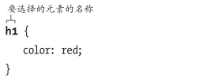
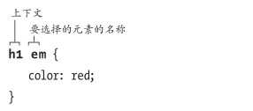
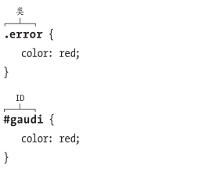
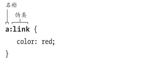
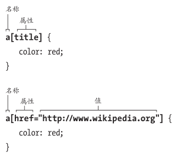
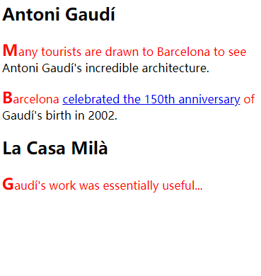

# 定义选择器

选择器决定样式规则应用于哪些元素。

## 构造选择器

选择器的五个不同的标准：

- 元素的类型或者名称
  
- 元素所在的上下文
  
- 元素的类或者ID
  
  
- 元素的伪类或伪元素
  
- 元素是否有某些属性和值
  

## 按名称选择元素

最常用的标准是元素的名称，也就是**类型选择器**。例如选择所有`h2`元素的字体颜色都是红色：`h2{color:red;}`

## 按类或者ID选择元素

类选择器以`.`开头后跟类名：`.className{样式}`

ID选择器以`#` 开头后跟ID：`#idName{样式}`

可以单独用类选择器和ID选择器，也可以和其他选择器标准混在一起使用：

```css
h1.news{
    color:red;	/* 仅作用于h1标记 new类下的内容 */
}
```

最好避免创建描述事物是如何显式的`class`名称，也就是描述性类名，因为将来可能改变样式。

比如现在命名`<h1 class="red">大标题</h1>`，最好不要这么做，因为将来如果觉得绿色更好看呢？

如果要定位的元素有多个类名，可以在选择器里把它们连在一起，比如`.architect.bto{color:blue;}`任何`.architect`或者`.bio`选择器的规则仍会应用到这个元素，但是`.architect.bio`的规则的特殊性更加高，所以如果有样式冲突，那么相对于单个`.architect`或者`.bio`，多类选择器的优先级会更高。

- 一个页面中一个id只能出现在一个元素上。也就是id的样式不能复用。
- ID选择器的特殊性比类选择器强很多，如果要覆盖ID选择器，那就要更加特殊的CSS规则。

## 按上下文选择元素

可以根据元素的祖先、父元素或者同胞元素来定位元素。

比如定位`class="architect"`内所有的元素`p`，不管第几代，全都找到

```css
.architect p {
    color: red;
}

/* 优先级比上面的高 定位article标记且类名为architect 下的所有p标记*/
article.architect p {			
    color: red;
}
```

**祖先**(ancestor)是包含目标元素(**后代**，descendant)的任何元素，不管它们间隔多少代。

父元素是直接包含另一个元素的元素，它们只隔一代，被包含的元素称之为子元素。


CSS3将基于元素祖先的选择器(也就是空格)称作**后代结合符**，以往称作**后代选择器**或者包含选择器。

CSS也有**子结合符**，可以为父元素的**直接后代**(子元素)定义样式规则。CSS3前称为**子选择器**。

```css
.architect > p {
    color: red;
}
```

**同胞**(sibling)元素是拥有同一父元素的任何类型的子元素。**相邻同胞元素**(adjacent sibling)是直接相互毗邻的元素，即它们之间没有其他的同胞元素。

```html
<!--相邻同胞元素示例-->
<h1>...</h1>
<p>...</p>
```

**CSS相邻同胞结合符**(adjacent sibling combinator)可以选择直接跟在指定的同胞元素后面的同胞元素。

```css
/* 只有跟在同胞p元素 后面的 p元素显式称为红色 */
.archiect p+p {
    color: red;
}
```

如果要对除第一个段落之外的所有段落进行缩进，相邻同胞结合符就很有用。

CSS3出了**普通同胞结合符**，通过它可以选择那些并非直接出现在另一个同胞元素后面的同胞元素。于相邻同胞结合符的区别是用`~`而不是`+`。

```css
/* 让任何属于同一父元素的同胞h1后面的h2元素显示为红色 相不相邻都无所谓 */
h1 ~ h2 {
    color:red;
}
```

## 选择第一个或者最后一个元素

```html
<ul>
    <li>one</li>
    <li>two</li>
    <li>three</li>
</ul>
```

这时就要用到伪类`:first-child`和`:last-child`

```css
/* 将第一个li字体颜色设置为红色 */
li:first-child {
    color: red;
}

/* 将最后一个li字体颜色设置为绿色 */
li:last-child {
    color: green;
}
```

`:last-child`伪类添加到CSS的时间晚于`:first-child`。所以IE9前不支持`:last-child`。

在伪类之前添加其他选择器可以使其特殊性更加高。

## 选择元素的第一个字母或者第一行

可以用`:first-letter`和`:first-line`伪元素只选择元素的第一个字母或者第一行。

```html
<article class="architect">
	<h1>Antoni Gaudí</h1>
	<p>Many tourists are drawn to Barcelona to see Antoni Gaudí's incredible architecture.</p>
	<p>Barcelona <a href="http://www.gaudi2002.bcn.es/english/" rel="external">celebrated the 150th anniversary</a> of Gaudí's birth in 2002.</p>
	<h2 lang="es">La Casa Milà</h2>
 	<p>Gaudí's work was essentially useful...</p>
</article>
```

可以直接晓得`:first-letter`定位哪个字母，但是`first-line`影响的单词只有在浏览器里排布时才能晓得。

```css
p:first-letter {
    color:red;
    font-size: 1.4em;
    font-weight: bold;
}

p:first-line {
    color:red;
}
```



只有部分CSS属性可以应用到`:first-letter`伪元素。

IE8后的，会把第一个字母前的标点符号当成第一个字母。

CSS3中，`:first-line`的语法是`::first-line`，`:first-letter`的语法是`::first-letter`。也就是两个冒号替代一个冒号。目的是把伪元素和伪类分开。伪元素是双冒号，伪类是单冒号。

**伪元素**(pseudo-element)是HTML里不存在的元素。比如定义一个字母或者第一行文字时，没有在HTML里作相应的标记。它们是另一个元素(如本例子中的`p`元素)的部分内容。

**伪类**(pseudo-class)应用于一组HTML元素，无需我们在HTML里用类标记它们。比如不用专门写成：`class="first-child"`

之所以还能用单冒号版本的伪类，是因为浏览器还支持，其实已经被废弃了。

不过IE9之前的IE也不支持双冒号，所以其实也能继续用单冒号。

## 按状态选择链接元素

CSS允许根据链接的当前状态对它们进行格式化，方法是输入`a`(`a`是链接元素)，后跟`:`冒号，然后再跟个想要影响的链接状态：

- `link`：没被激活过或者指向过
- `visited`：已经激活过
- `focus`：链接是通过键盘选择且已经准备好激活(链接处于活跃状态时也会获得焦点)
- `hover`：光标指向链接时
- `active`：激活过的链接的外观

 也可以对其他元素使用`:active`和`:hover`。比如对`p`设置`:hover`伪类：`p:hover{ color: red; }`，之后鼠标停在任何段落上都会显式红色。

链接可能同时处于多种状态，且晚出现的会覆盖前面的规则，所以要按顺序定义规则：

1. `link`
2. `visited`
3. `focus`
4. `hover`
5. `active`

缩写LVFHA

## 按属性选择元素

可以对具有给定属性或者属性值的元素进行格式化。

```css
/* 选择所有具有class属性的段落 */
p[class] {
    color: red;
}
```

参考表：

| 选择器                | 属性值                                                       |
| --------------------- | ------------------------------------------------------------ |
| [attribute]           | 匹配指定属性，不管具体值是什么                               |
| [attribute="value"]   | 完全匹配指定属性值                                           |
| [attribute~="value"]  | 属性值包含有`value`的元素会被选中，不同的属性值可以以空格分隔 |
| [attribute\|="value"] | 匹配属性值以`value`或者`value-`开头的元素                    |
| [attribute^="value"]  | 匹配属性值以`value`开头的元素                                |
| [attribute$="value"]  | 匹配属性值以`value`结尾的元素                                |
| [attribute*="value"]  | 匹配属性值包含子字符串`value`的元素                          |

`~=`和`*=`还有`=`的区别：

- `~=`可以用`two`匹配到`class="one two three"`这样的元素
- `*=`可以用`tw`做到与`~=`相同的效果
- `=`就需要用`one two three`这种完整的匹配了

联合使用示例：

```css
/* 匹配a元素既有href属性 又有属性值包含howdy的title属性 */ 
a[href][title~="howdy"] {
    color: red;
}
```

## 指定元素组

经常需要把相同的样式规则应用在多个元素。其实只需要把各个选择器用逗号`,`分隔即可。

```css
/* h1和h2的字体都设为红色 */
h1,
h2 {
    color: red;
}
```

虽然不是非得一个选择器一行，但是最好这么做，以便于一眼看出选择了哪些元素。

## 组合使用选择器

```css
/* 
project类里的 所有h2标记(这些h2标记需要lang的值是es或es-开头)旁边的p标记里的 em元素
*/
.project h2[lang|="es"] + p em {
    color: red;
}
```

